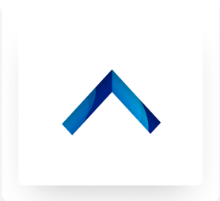
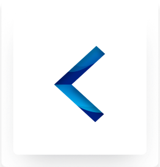
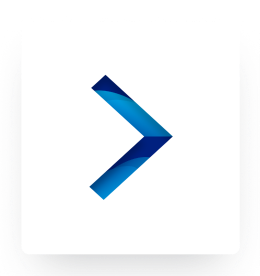
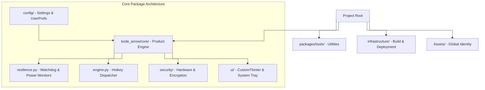
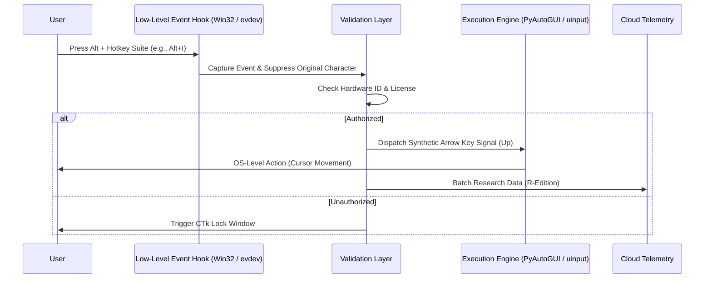

<div align="center">


# KodeArrow

### The Next Evolution in Keyboard Navigation

**A Masterpiece of Ergonomic Engineering by Ahmad Hassan (B-Ted)**

[](https://opensource.org/licenses/MIT)
[](https://www.python.org/downloads/)
[-red.svg)](#-getting-started)
[](#architecture-overview)
[](#-production-binary-compilation)
<br><br>
[ Official Website](https://ahmadhassan-bted.github.io/KodeArrow/) • [ Key Features](#-key-features) • [ Windows Guide](#-windows-setup--production-guide) • [ Linux Guide](#-arch-linux--kde-plasma-guide)

---

**KodeArrow** is a production-grade productivity suite designed to revolutionize keyboard ergonomics.
It bridges the gap between hardware input and fluid navigation, enabling a seamless "Home Row" experience for power users across **Windows** and **Linux (Arch Linux / KDE Plasma X11 & Wayland)**.

[Architecture](#-architecture-overview) • [Full Suite](#-the-ergonomic-suite) • [Research](#-scientific-validation) • [Windows & Linux Setup](#-getting-started)

</div>

---

## 🌟 The Vision & Philosophy

> "Navigation should be an extension of thought, not a physical strain."
> — **Ahmad Hassan (B-Ted)**

Navigation inefficiency is often ignored until it causes physical fatigue. KodeArrow was engineered to solve the "Hand Travel" problem. By transforming the home row into a dynamic navigation engine, it allows developers and researchers to maintain absolute focus without breaking their physical workflow. This project represents a shift from _human-adapting-to-tools_ to _tools-adapting-to-human-ergonomics_.

---

## ⌨ The Ergonomic Suite

KodeArrow provides a complete document control system without leaving the home row.

<div align="center">

### 🎯 Navigation & Editing

| Key                          | Mapping                                        | Action                          |
| :--------------------------- | :--------------------------------------------- | :------------------------------ |
| **Alt + I/J/K/L**            | ⬆ ⬅ ⬇ ➡                                     | **Core Directional Navigation** |
| **Alt + U / O**              | **Home / End**                                 | **Line Boundaries**             |
| **Alt + P / ;**              | **Del / Backspace**                            | **Instant Text Deletion**       |
| **Alt + [ / '**              | **PgUp / PgDn**                                | **Document Paging**             |
| **Ctrl + Alt + U/I/O/J/K/L** | **Ctrl + Shift + Home/Up/End/Left/Down/Right** | **Word/Text Selection (Free)**  |
| **Ctrl + Alt + P / ;**        | **Ctrl + Del / Backspace**                     | **Word Delete / Bksp (Free)**   |

</div>

### 🎨 Visual Mapping Overview

<div align="center">

|  Home Row   |     Mapping     |                           Icon                           |
| :---------: | :-------------: | :------------------------------------------------------: |
| **Alt + I** |  **Arrow Up**   |     |
| **Alt + J** | **Arrow Left**  |   |
| **Alt + K** | **Arrow Down**  |   |
| **Alt + L** | **Arrow Right** |  |

</div>

---

## 📊 Edition Comparison

Choose the edition that fits your professional workflow.

| Feature                    | Standard Edition | Research Edition |
| :------------------------- | :--------------: | :--------------: |
| **Full Ergonomic Suite**   |    ✅ Active     |    ✅ Active     |
| **Cloud Sync**             |    ✅ Active     |    ✅ Active     |
| **Telemetry Tracking**     |     ❌ None      |   ✅ Real-time   |
| **Multi-Device Support**   |     Up to 4      |   1 Dedicated    |
| **Research Participation** |      ❌ No       |      ✅ Yes      |

---

## 🚀 Universal Community License

> [!TIP]
>
> ### 🎁 Join the Ergonomic Revolution
>
> To support developers, students, and ergonomic enthusiasts worldwide, we have created an open **Universal Activation Email** that unlocks the complete premium suite of **KodeArrow** forever!

<div align="center">

|  Community Key                    | `freeforever@kodearrow.dev`                  |
| :---------------------------------- | :------------------------------------------- |
| **Status**                          | 🟢 **Active & Lifetime**                     |
| **Allowed Devices**                 | ♾️ **Unlimited Connections**                 |
| **Ergonomic Research Contribution** | 🔬 **Active (Anonymous Telemetry Tracking)** |

</div>

### 🔓 Why Use the Community Key?

- **Zero Limits**: Bypasses the standard 4-device hardware restriction entirely. Use it across all of your personal and work machines.
- **Contribute to Science**: By using this license, your app automatically registers device stats and anonymous telemetry to our database. You are directly contributing data to our ergonomic research and helping shape the future of human-computer interaction!
- **Lifetime Freedom**: Never expires. Managed centrally and kept active permanently through the cloud control console.

> **To Unlock**: Simply enter `freeforever@kodearrow.dev` when prompted during the initial startup activation, and enjoy the ultimate home-row experience.

---

## 💻 Operating System & Architecture Support

KodeArrow runs natively on both **Windows** and **Linux (Arch Linux / KDE Plasma)**.

| OS Environment | Executable / Distribution | Key Suppression Backend | System Autostart |
| :--- | :--- | :--- | :--- |
| **Windows 10 / 11** | `KodeArrow_Standard.exe` (PyInstaller `.exe`) | Win32 Hook API (`user32.dll`) | Windows Registry (`winreg`) |
| **Arch Linux (KDE Plasma X11/Wayland)** | `KodeArrow_Standard` (Standalone ELF Binary) | `evdev` + `uinput` kernel module | XDG Autostart (`~/.config/autostart`) |

---

## 🛠️ Getting Started & Production Guides

### 🪟 Windows Setup & Production Guide

1. **Clone the Repository**:
   ```bash
   git clone https://github.com/AhmadHassan-BTed/KodeArrow.git
   cd KodeArrow
   ```
2. **Install Dependencies**:
   ```bash
   pip install -r config/requirements.txt
   ```
3. **Run from Source**:
   ```bash
   python main.py --version r_edition
   ```
4. **Compile Windows `.exe` Binary**:
   ```bash
   python infrastructure/build/build.py
   ```
   *The compiled `.exe` binary will be located in `dist/Standard/KodeArrow_Standard.exe`.*

---

### 🐧 Arch Linux & KDE Plasma Guide

KodeArrow features native hardware event grabbing (`evdev` / `uinput`) for zero-latency shortcut suppression under **KDE Plasma 6 / 5** (both Wayland and X11 sessions).

#### Step 1: One-Time Permission Setup
On Linux, global low-level hardware event listening and key injection require permission to access `/dev/input/` and `/dev/uinput`. Run our automated permission setup script:

```bash
bash scripts/setup_linux_permissions.sh
```
*This installs `/etc/udev/rules.d/99-kodearrow-input.rules` and adds your user to the `input` & `uinput` groups, allowing KodeArrow to run as a standard non-root user without `sudo`.*

#### Step 2: Install Linux Dependencies
```bash
pip install -r requirements-linux.txt
```

#### Step 3: Run KodeArrow
```bash
python3 main.py --version r_edition
```

#### Step 4: Compile Native Standalone Linux Binary
Just like Windows builds an `.exe`, PyInstaller on Arch Linux compiles Python source code and all C-libraries into a **single standalone Linux binary executable**:

```bash
python3 infrastructure/build/build.py
```
*The compiled native Linux binary will be generated at `dist/Standard/KodeArrow_Standard`.*

To launch the compiled Linux binary directly:
```bash
./dist/Standard/KodeArrow_Standard --version r_edition
```

#### Step 5: KDE Plasma System Integration & Autostart
To add KodeArrow to your KDE Plasma Application Menu and system tray:
```bash
cp infrastructure/kodearrow.desktop ~/.local/share/applications/
```

To enable autostart on KDE boot, toggle the **"Launch on System Startup"** switch in the KodeArrow Dashboard GUI, or copy the desktop launcher:
```bash
cp infrastructure/kodearrow.desktop ~/.config/autostart/
```

---

## ⚙ Production Binary Compilation (`PyInstaller`)

KodeArrow uses a cross-platform build pipeline (`infrastructure/build/build.py`).

```mermaid
%%{init: {'flowchart': {'curve': 'stepBefore'}}}%%
graph LR
    S[Source Code] --> B[infrastructure/build/build.py]
    B --> A[Asset & Config Bundling]
    A --> P[PyInstaller Engine]
    P --> WIN[dist/Standard/KodeArrow_Standard.exe (Windows)]
    P --> LIN[dist/Standard/KodeArrow_Standard (Linux ELF Binary)]
    style WIN fill:#3B82F6,stroke:#333,stroke-width:2px,color:#fff
    style LIN fill:#10B981,stroke:#333,stroke-width:2px,color:#fff
```

### Building Production Binaries:
- **Windows**: Run `python infrastructure/build/build.py` $\rightarrow$ Generates standalone `KodeArrow_Standard.exe`.
- **Linux (Arch)**: Run `python3 infrastructure/build/build.py` $\rightarrow$ Generates standalone executable binary `KodeArrow_Standard` (no Python runtime required on target machine!).

---

## 🔬 Scientific Validation

KodeArrow is a scientifically validated ergonomic pattern. Our research lab uses real-time metrics to optimize the navigation workflow.

<div align="center">

<br>
<i>Figure 1: 3D Visualization of user accuracy across the Alt+IJKL navigation field.</i>
</div>

---

## 🏗️ Architecture Overview

The system follows a **Tiered Mono-Repo** structure, ensuring zero coupling between the product core and research utilities.



---

## 🔄 Request Lifecycle

How a single hotkey press travels through the layers of KodeArrow.



---

<div align="center">

**Engineered by Ahmad Hassan (B-Ted)**
_Redefining Human-Computer Interaction_

[Official Website](https://ahmadhassan-bted.github.io/KodeArrow/) • [GitHub](https://github.com/AhmadHassan-BTed) • [Portfolio](https://ahmadhassan-bted.github.io/KodeArrow/) • [LinkedIn](https://www.linkedin.com/in/ahmad-hassan-52ab4225b/)

</div>

