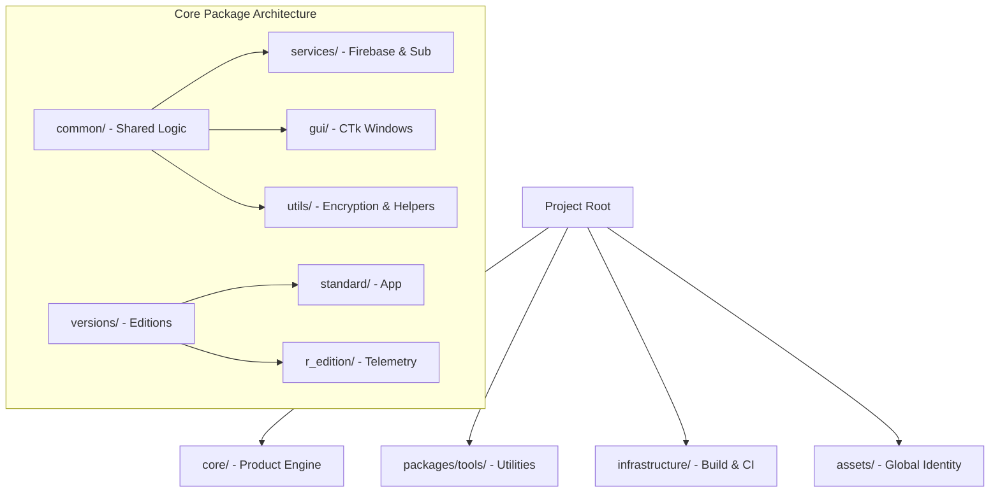
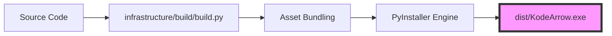

<div align="center">


# 🏹 KodeArrow

### The Next Evolution in Keyboard Navigation

**A Masterpiece of Ergonomic Engineering by Ahmad Hassan (B-Ted)**

[](https://opensource.org/licenses/MIT)
[](https://www.python.org/downloads/)
[](#architecture-overview)
[](#build--deployment-flow)

---

**KodeArrow** is a production-grade productivity suite designed to revolutionize keyboard ergonomics.
It bridges the gap between hardware input and fluid navigation, enabling a seamless "Home Row" experience for power users.

[Architecture](#-architecture-overview) • [Full Suite](#-the-ergonomic-suite) • [Research](#-scientific-validation) • [Installation](#-getting-started)

</div>

---

## 📖 The Vision & Philosophy

> "Navigation should be an extension of thought, not a physical strain."
> — **Ahmad Hassan (B-Ted)**

Navigation inefficiency is often ignored until it causes physical fatigue. KodeArrow was engineered to solve the "Hand Travel" problem. By transforming the home row into a dynamic navigation engine, it allows developers and researchers to maintain absolute focus without breaking their physical workflow. This project represents a shift from _human-adapting-to-tools_ to _tools-adapting-to-human-ergonomics_.

---

## ⌨️ The Ergonomic Suite

KodeArrow provides a complete document control system without leaving the home row.

<div align="center">

### 🧭 Navigation & Editing

| Key               | Mapping             | Action                          |
| :---------------- | :------------------ | :------------------------------ |
| **Alt + I/J/K/L** | ⬆️ ⬅️ ⬇️ ➡️         | **Core Directional Navigation** |
| **Alt + U / O**   | **Home / End**      | **Line Boundaries**             |
| **Alt + P / ;**   | **Del / Backspace** | **Instant Text Deletion**       |
| **Alt + [ / '**   | **PgUp / PgDn**     | **Document Paging**             |

</div>

### 🎨 Visual Mapping Overview

<div align="center">

|  Home Row   |     Mapping     |                           Icon                           |
| :---------: | :-------------: | :------------------------------------------------------: |
| **Alt + I** |  **Arrow Up**   |     |
| **Alt + J** | **Arrow Left**  |   |
| **Alt + K** | **Arrow Down**  |   |
| **Alt + L** | **Arrow Right** |  |

</div>

---

## 🏗️ Architecture Overview

The system follows a **Tiered Mono-Repo** structure, ensuring zero coupling between the product core and research utilities.



---

## 🔄 Request Lifecycle

How a single hotkey press travels through the layers of KodeArrow.

```mermaid
sequenceDiagram
    participant U as User
    participant H as Keyboard Hook (Low-Level)
    participant V as Validation Layer
    participant E as Execution Engine (PyAutoGUI)
    participant C as Cloud Telemetry

    U->>H: Press Alt + [U, I, O, P, J, K, L, ;, [, ']
    H->>V: Capture Event & Suppress
    V->>V: Check Hardware ID & License
    alt Authorized
        V->>E: Dispatch Virtual Key Signal
        E->>U: OS-Level Action (Nav/Edit)
        V->>C: Batch Research Data (R-Edition)
    else Unauthorized
        V->>U: Trigger CTk Padlock Window
    end
```

---

## 📊 Edition Comparison

Choose the edition that fits your professional workflow.

| Feature                    | Standard Edition | Research Edition |
| :------------------------- | :--------------: | :--------------: |
| **Full Ergonomic Suite**   |    ✅ Active     |    ✅ Active     |
| **Cloud Sync**             |    ✅ Active     |    ✅ Active     |
| **Telemetry Tracking**     |     ❌ None      |   ✅ Real-time   |
| **Multi-Device Support**   |     Up to 4      |   1 Dedicated    |
| **Research Participation** |      ❌ No       |      ✅ Yes      |

---

## 🧪 Scientific Validation

KodeArrow is a scientifically validated ergonomic pattern. Our research lab uses real-time metrics to optimize the navigation workflow.

<div align="center">

<br>
<i>Figure 1: 3D Visualization of user accuracy across the Alt+IJKL navigation field.</i>
</div>

---

## ⚙️ Execution & Compilation
KodeArrow uses a standardized entry point system for both execution and distribution.

### Running the Application
Launch specific editions using the `--version` flag:
*   **Standard Edition**: `python main.py --version standard`
*   **Research Edition**: `python main.py --version r_edition`

### Compiling to Executable
The production build pipeline is fully automated. To generate a standalone `.exe`:
```bash
python infrastructure/build/build.py
```
*Generated binaries will be located in the `dist/` directory.*

### Running the Test Suite
Verify architectural and logical integrity before deployment:
```bash
python -m pytest
```

---

## 🚀 Getting Started

New people are welcomed to participate in development.

### Prerequisites

- Python 3.12 or higher
- Windows 10/11 (Preferred for Win32-hook stability)

### Installation

1. **Clone & Enter**:
   ```bash
   git clone https://github.com/AhmadHassan-BTed/KodeArrow.git
   ```
2. **Environment Setup**:
   ```bash
   pip install -r config/requirements.txt
   ```
3. **Configuration**:
   Add your Firebase credentials to `config/.env` (see `.env.example`).
4. **Execution**:
   ```bash
   python main.py --version standard
   ```

---

## 🛠️ Build & Deployment Flow

The automated pipeline ensures consistent, high-performance binaries for end-users.



---

<div align="center">

**Engineered by Ahmad Hassan (B-Ted)**
_Redefining Human-Computer Interaction_

[GitHub](https://github.com/AhmadHassan-BTed) • [Portfolio](https://bted.wuaze.com/) • [LinkedIn](https://www.linkedin.com/in/ahmad-hassan-52ab4225b/)

</div>
