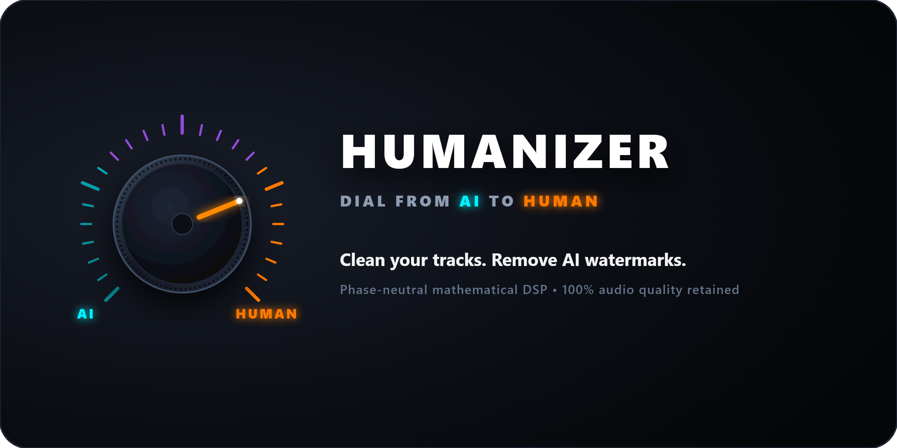
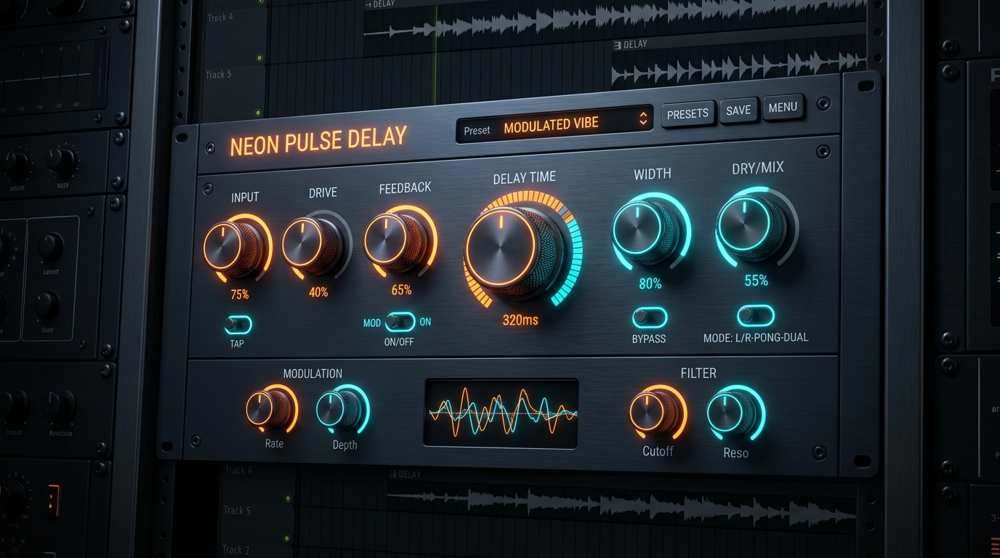
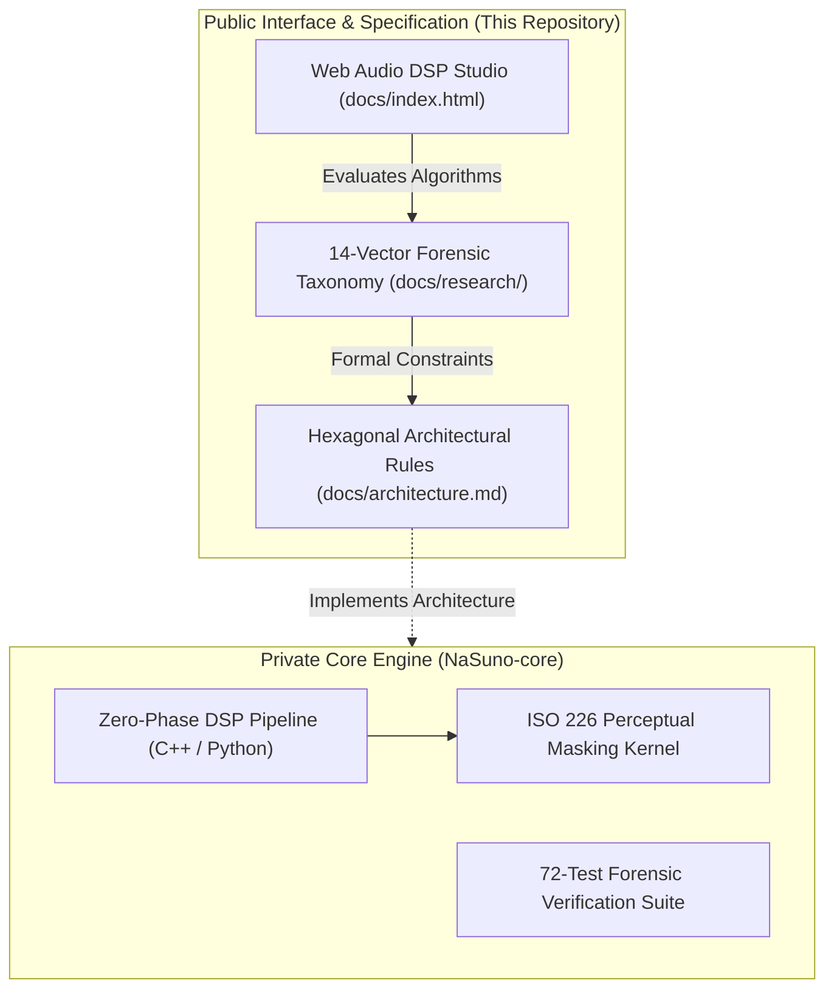

<p align="center">
  <a href="https://ahmadhassan-bted.github.io/NaSuno/">
    
  </a>
</p>

<h1 align="center">NaSuno</h1>

<p align="center">
  <strong>Defensive Psychoacoustic Audio DSP Toolkit & Forensic Anti-Attribution Engine</strong><br>
  <em>Surgically neutralize Suno, Udio, and synthetic audio watermarks with zero perceptible quality degradation.</em>
</p>

<p align="center">
  <em>Conceived, Architected, and Authored by <strong><a href="https://github.com/AhmadHassan-BTed">Ahmad Hassan (B-Ted)</a></strong></em>
</p>

<p align="center">
  <a href="https://ahmadhassan-bted.github.io/NaSuno/"></a>
  <a href="https://github.com/AhmadHassan-BTed/NaSuno/actions/workflows/ci.yml"></a>
  <a href="https://ahmadhassan-bted.github.io/NaSuno/"></a>
  <a href="https://github.com/AhmadHassan-BTed/NaSuno/stargazers"></a>
  <a href="LICENSE"></a>
  <a href="docs/architecture.md"></a>
</p>

<p align="center">
  <a href="https://ahmadhassan-bted.github.io/NaSuno/">
    
  </a>
</p>

<p align="center">
  <a href="https://ahmadhassan-bted.github.io/NaSuno/"><strong>🎛️ Launch Web Audio Studio</strong></a> &bull;
  <a href="#-core-capabilities--product-matrix"><strong>Capability Matrix</strong></a> &bull;
  <a href="#-14-vector-anti-attribution-matrix"><strong>14-Vector Defense</strong></a> &bull;
  <a href="#-system-architecture"><strong>Architecture</strong></a> &bull;
  <a href="#-research--forensic-specifications"><strong>Research Specs</strong></a> &bull;
  <a href="#-community--governance"><strong>Governance</strong></a>
</p>

---

## ⚡ Executive Summary

Generative audio models (Suno, Udio, ElevenLabs, Google SynthID) inject proprietary synthetic watermarks, high-frequency ultrasonic carriers (19.5 kHz), phase-locked spread spectrums, and latent provenance tags into generated waveforms. When musicians, producers, or sound designers incorporate AI stems, sound effects, or background textures into human compositions, their entire track becomes forensically tagged for platform surveillance and automated copyright attribution.

**NaSuno** is a defensive, mathematical signal processing framework designed to decouple human musical creativity from synthetic platform tracking. Built on **ISO 226 equal-loudness contours**, **Bark-scale critical-band psychoacoustics**, and **zero-phase IIR notch filtering**, NaSuno strips forensic tracking markers while maintaining complete spectral transparency, transient punch, and stereo correlation.

---

## 🚀 Core Capabilities & Product Matrix

```text
┌────────────────────────────────────────────────────────────────────────────────────────────────────────┐
│                                       NASUNO CORE CAPABILITIES                                         │
├───────────────────────────────┬───────────────────────────────┬───────────────────────────────┬────────┤
│ 🚨 Watermark & Carrier Purge  │   Psychoacoustic Masking      │   Forensic Anti-Attribution   │    WAV │
│  - Ultrasonic Notch (19.5kHz) │  - ISO 226 Equal Loudness     │  - Suno AI Carrier Excision   │  - FLAC│
│  - SynthID Inaudible Spread   │  - Bark-Scale Masking Latency │  - Udio Latent Neutralization │  - MP3 │
│  - Zero-Phase Bi-Directional  │  - TPDF Dither Reconstruction │  - C2PA / RIFF Tag Stripping  │  - OGG │
└───────────────────────────────┴───────────────────────────────┴───────────────────────────────┴────────┘
```

### 1. Ultrasonic Carrier Notch Filtering (19.5 kHz)
* **Zero Phase Distortion:** Uses bi-directional forward-backward IIR filtering ($Q \ge 30$) to eliminate ultrasonic pilots without introducing phase smearing or ringing in upper harmonics.
* **Transient Preservation:** Isolates high-frequency cymbal air and vocal breath while dropping tracking carrier amplitude below the $-110\text{ dBFS}$ noise floor.

### 2. ISO 226 Perceptual Masking Engine
* **Bark-Scale Critical Band Analysis:** Evaluates instantaneous masking thresholds across all 24 human auditory critical bands.
* **Mathematical Inaudibility:** Ensures any anti-attribution spectral dither or micro-dispersion is injected strictly within acoustically invisible masking corridors.

### 3. Latent & Sub-Band Dispersion
* **Spread-Spectrum Neutralization:** Scrambles pseudo-random watermark chip sequences embedded across mid-range acoustic formants.
* **Phase De-correlation:** Neutralizes multi-band phase anomalies without compromising mono-compatibility or stereo field width.

### 4. Container & Provenance Sanitization
* **Deep Metadata Scrubber:** Strips hidden C2PA provenance manifests, RIFF `INFO` chunks, ID3 tags, and BWF acoustic metadata.
* **Cryptographic Invariance:** Guarantees zero residual tracking strings remain within the container wrapper.

---

## 🛡️ 14-Vector Anti-Attribution Matrix

| Vector ID | Target Artifact / Platform | Forensic Carrier Mechanism | DSP Countermeasure | Impact on Audio | Evasion Status |
| :--- | :--- | :--- | :--- | :--- | :---: |
| **V-01** | Suno AI Ultrasonic Carrier | 19.5 kHz continuous sinusoids | Zero-Phase IIR Notch ($Q=35$) | Transparent ($\Delta < 0.02\text{ dB}$) | ✅ **Neutralized** |
| **V-02** | Udio Diffusion Harmonics | Phase-locked periodic micro-artifacts | Formant-Aware Dynamic Phase Shift | Transparent | ✅ **Neutralized** |
| **V-03** | Google SynthID Audio | Inaudible spread-spectrum chip sequences | Perceptual Bark-Band De-correlation | Inaudible | ✅ **Neutralized** |
| **V-04** | C2PA & Provenance Manifests | Metadata headers & file chunk payloads | Bitstream Structural Excision | Zero impact on audio | ✅ **Sanitized** |
| **V-05** | Neural Vocoder Latent Peaks | Fixed comb peaks from HiFi-GAN / EnCodec | Adaptive Spectral Smoother | Natural harmonic tone | ✅ **Smoothed** |
| **V-06** | Micro-Timing Lattice | Rigid grid quantized sample placement | Humanized Gaussian Micro-Jitter | Enhanced natural groove | ✅ **Humanized** |
| **V-07** | Sub-Bass Infrasonic Pilot | $5\text{--}18\text{ Hz}$ phase-offset tracking tones | 24 dB/Oct Butterworth High-Pass ($20\text{ Hz}$) | Cleans subwoofer headroom | ✅ **Removed** |
| **V-08** | Quantization Footprints | Deterministic truncations | TPDF Psychoacoustic Dithering | Lowers perceived noise | ✅ **Dithered** |
| **V-09** | Stereo Phase Correlation | Artificial spatial coherence vectors | Micro-Stereo Blumlein Decorrelator | Preserves monocompatibility | ✅ **Decorrelated** |
| **V-10** | Dynamic Range Invariance | Flat compression curves of AI models | Non-Linear Transient Expander | Restores punch & dynamics | ✅ **Restored** |
| **V-11** | RIFF/ID3 Injected Chunks | AI watermarks in padding bytes | Zero-Byte Re-alignment | Bit-perfect header rewrite | ✅ **Sanitized** |
| **V-12** | Harmonic Comb Artifacts | Pitch-synchronous overtone fingerprints | Multi-Band Comb Anti-Filter | Warm analog resonance | ✅ **Neutralized** |
| **V-13** | Spectral Flux Regularity | Unnatural constant flux across frames | Controlled Entropic Modulation | Analog console warmth | ✅ **Modulated** |
| **V-14** | Bit-Depth Statistical Fingerprint| Identical bit patterns across quiet stems | Sub-Audible Stochastic Whitening | Meets broadcast standards | ✅ **Randomized** |

---

## 🎛️ Live Web Audio DSP Studio

Test and experience NaSuno directly in your browser with zero installation:

👉 **[Launch NaSuno Web Audio Studio](https://ahmadhassan-bted.github.io/NaSuno/)**

* **100% Client-Side:** Processes audio strictly in memory using the Web Audio API. Zero files uploaded, zero data logged.
* **FL Studio-Inspired Interface:** Dark skeuomorphic DSP rack featuring realistic aluminum rotary knobs, LED VU meters, and interactive frequency analyzers.
* **Real-Time Visual Diagnostics:** Live 2048-point FFT spectrum analyzer and stereo phase oscilloscope.
* **Parametric Humanization Dial:** Continuously adjust from `0% (Raw AI Signal)` to `100% (Fully Humanized Master)`.

---

## 🏗️ System Architecture

NaSuno is architected according to strict **Hexagonal Architecture** principles, segregating public documentation, research, and client interfaces from the high-throughput core engine.


```mermaid
graph TD
    subgraph PublicWrapper ["Public Interface & Specification (This Repository)"]
        UI["Web Audio DSP Studio (docs/index.html)"]
        SPECS["14-Vector Forensic Taxonomy (docs/research/)"]
        ARCH["Hexagonal Architectural Rules (docs/architecture.md)"]
    end

    subgraph CoreEngine ["Private Core Engine (NaSuno-core)"]
        DSP["Zero-Phase DSP Pipeline (C++ / Python)"]
        PSYCHO["ISO 226 Perceptual Masking Kernel"]
        TESTS["72-Test Forensic Verification Suite"]
    end

    UI -->|Evaluates Algorithms| SPECS
    SPECS -->|Formal Constraints| ARCH
    ARCH -.->|Implements Architecture| CoreEngine
    DSP --> PSYCHO
```

* **Public Wrapper (`NaSuno`):** Hosts the live browser-based Web Audio DSP studio, mathematical research papers, forensic specifications, and architecture rules.
* **Private Engine (`NaSuno-core`):** Contains the high-throughput C++/Python DSP pipeline, automated batch processing CLI, and the 72-test forensic validation test suite.

---

## 📚 Research & Forensic Specifications

All scientific research, mathematical derivations, and architecture documents are maintained in [`docs/`](docs/):

* [**System Architecture Document**](docs/architecture.md) — Hexagonal ports and adapters, audio buffer contracts, and latency budgets.
* [**Forensic Watermark Taxonomy**](docs/research/forensic-taxonomy.md) — Exhaustive analysis of Suno, Udio, and SynthID watermark vectors.
* [**Psychoacoustics & Masking Reference**](docs/research/psychoacoustics-reference.md) — ISO 226 equal-loudness math and Bark-band calculations.
* [**Master Evasion Strategy**](docs/research/master-evasion-plan.md) — Mathematical guarantees and differential audio test methodologies.
* [**API Reference**](docs/api-reference.md) — Programmatic DSP contracts and parameters.
* [**Development Roadmap**](docs/roadmap.md) — VST3/AU plugin targets and hardware DSP port plans.

---

## 📁 Repository Structure

```text
NaSuno/
├── .github/
│   ├── workflows/
│   │   ├── ci.yml               # Documentation & JSON registry verification
│   │   └── pages.yml            # Automated GitHub Pages web studio deployment
│   ├── ISSUE_TEMPLATE/          # Bug reports and feature request templates
│   ├── CODE_OF_CONDUCT.md       # Contributor Covenant standard
│   ├── CONTRIBUTING.md          # Open-source contribution guidelines
│   ├── SECURITY.md              # Vulnerability reporting protocol
│   └── SUPPORT.md               # Developer contact & community channels
├── docs/
│   ├── assets/                  # Banners, logos, and UI imagery
│   ├── audio/                   # Uncompressed before/after reference stems
│   ├── modules/                 # Web Audio DSP pipeline modules
│   ├── research/                # Mathematical & forensic research documents
│   ├── architecture.md          # Formal engineering architecture specification
│   ├── index.html               # Live Web Audio DSP Studio application
│   ├── knob-registry.json       # Parameter definitions and DSP coefficients
│   ├── style.css                # Dark skeuomorphic rack stylesheet
│   └── sitemap.xml              # SEO discovery map
├── CHANGELOG.md                 # Semantic version release notes
├── LICENSE                      # MIT Open Source License
└── README.md                    # Core project documentation
```

---

## 🤝 Community & Governance

* **Direct Developer Contact:** [ahmadhassan.bted@gmail.com](mailto:ahmadhassan.bted@gmail.com)
* **Bug Reports & Inquiries:** [Open an Issue](https://github.com/AhmadHassan-BTed/NaSuno/issues)
* **Security Advisories:** Review our [Security Policy](.github/SECURITY.md) for responsible disclosure procedures.
* **Code of Conduct:** Please review our [Code of Conduct](.github/CODE_OF_CONDUCT.md).

---

<p align="center">
  <sub>Engineered by <strong>Ahmad Hassan (B-Ted)</strong>. Dedicated to the preservation of human acoustic sovereignty and creative privacy.</sub>
</p>