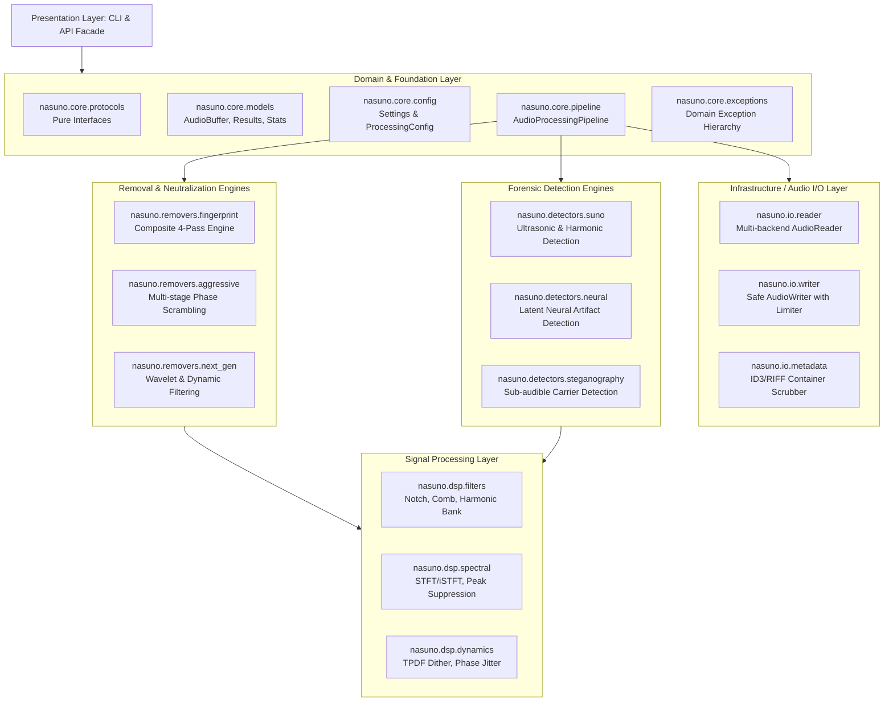
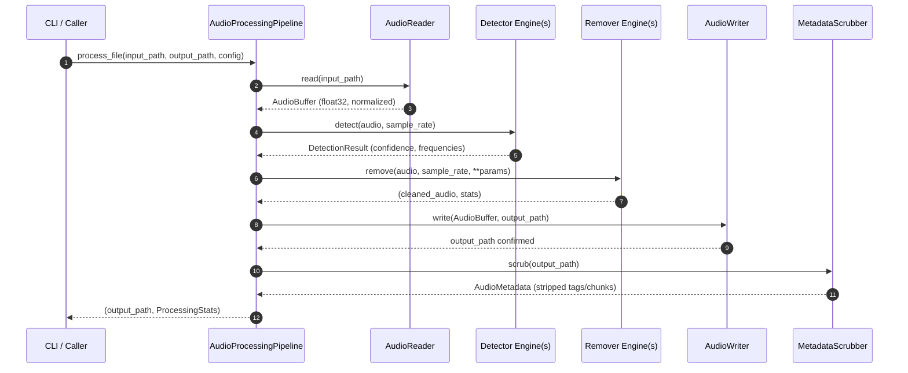
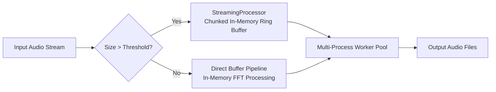

# NaSuno System Architecture

## 1. Architectural Philosophy & Principles

NaSuno is designed as an enterprise-grade audio forensics and privacy neutralization framework. It detects, analyzes, and mitigates synthetic watermarks, machine fingerprints, and tracking metadata embedded by AI audio generation systems (such as Suno AI, OpenAI, and ElevenLabs).

The system is constructed around four non-negotiable architectural axioms:

1. **Separation of Concerns (SoC)**: Digital Signal Processing (DSP) mathematics are strictly decoupled from binary container parsing, disk I/O, and runtime orchestration.
2. **Contract-Based Interfaces**: All engines implement formal `Protocol` definitions (`AudioDetectorProtocol`, `AudioRemoverProtocol`, `AudioReaderProtocol`, `AudioWriterProtocol`, `MetadataScrubberProtocol`) and inherit from abstract base classes (`BaseDetector`, `BaseRemover`).
3. **Data Coupling & Functional Cohesion**: Components communicate strictly through strongly-typed Data Transfer Objects (`AudioBuffer`, `DetectionResult`, `RemovalResult`, `ProcessingStats`, `AudioMetadata`). There is zero hidden global state, monkey-patching, or circular coupling.
4. **Resilient Degradation**: Optional deep learning and heavy DSP dependencies (e.g. `librosa`, `soundfile`, `mutagen`, `torch`) degrade gracefully to native NumPy/SciPy/Wave implementations when unavailable.

---

## 2. Multi-Tier Layered Architecture



---

## 3. Data Flow & Processing Lifecycle

When an audio file is processed through `AudioProcessingPipeline`, it follows a strict five-stage linear pipeline:



### Stage Explanations

1. **Ingestion & Normalization (`nasuno.io.reader`)**:
   Reads audio streams from MP3, WAV, FLAC, or OGG. Converts raw integer PCM or compressed floating-point formats into a normalized `AudioBuffer` (`float32` in `[-1.0, 1.0]`).
2. **Forensic Detection (`nasuno.detectors`)**:
   Performs Short-Time Fourier Transform (STFT) spectral analysis, detecting persistent ultrasonic carrier tones (typically between 15 kHz and 22 kHz), periodic harmonic structures, and statistical irregularities.
3. **Neutralization & Disruption (`nasuno.removers` & `nasuno.dsp`)**:
   Applies high-Q notch filters, adaptive comb filtering, phase dispersion, and time-stretching jitter to break machine-deterministic patterns while maintaining auditory transparency.
4. **Re-encoding & Limiting (`nasuno.io.writer`)**:
   Passes the processed buffer through a true-peak limiter to prevent numerical clipping, applies Triangular Probability Density Function (TPDF) dither, and writes to disk.
5. **Container Metadata Sanitization (`nasuno.io.metadata`)**:
   Scrubs proprietary RIFF chunks (e.g., `bext`, `cart`, `LIST`, `INFO`), ID3 tags, and encoder watermarks in binary container headers.

---

## 4. Contract Specifications

All subsystem boundaries are defined via runtime-checkable protocols:

### AudioDetectorProtocol
```python
class AudioDetectorProtocol(Protocol):
    def detect(self, audio: np.ndarray, sr: int) -> DetectionResult:
        ...
```

### AudioRemoverProtocol
```python
class AudioRemoverProtocol(Protocol):
    def remove(self, audio: np.ndarray, sr: int, **kwargs: Any) -> Tuple[np.ndarray, Dict[str, Any]]:
        ...
```

### AudioReaderProtocol
```python
class AudioReaderProtocol(Protocol):
    def read(self, file_path: Path) -> AudioBuffer:
        ...
```

### AudioWriterProtocol
```python
class AudioWriterProtocol(Protocol):
    def write(self, buffer: AudioBuffer, file_path: Path, format: Optional[str] = None) -> None:
        ...
```

---

## 5. Processing Profiles

NaSuno provides four standardized processing intensity tiers via `ProcessingConfig`:

| Profile      | Filter Order | STFT Size | Timing Jitter | Harmonic Clipping | Target Use Case |
| ------------ | ------------ | --------- | ------------- | ----------------- | --------------- |
| `gentle`     | 2            | 1024      | 0.1%          | Disabled          | Classical, acoustic, or vocal solos requiring maximum transparency |
| `moderate`   | 2            | 2048      | 0.2%          | 0.005             | Standard songs, pop, rock, electronic music (Default) |
| `aggressive` | 3            | 2048      | 0.4%          | 0.010             | Dense mixes with persistent ultrasonic carriers |
| `extreme`    | 4            | 4096      | 0.8%          | 0.020             | Heavily watermarked or forensically tracked audio |

---

## 6. Forensic Threat Model & Neutralization Mechanisms

Generative AI audio platforms (such as Suno AI, Udio, ElevenLabs, and MusicLM) embed distinctive structural signatures into synthesized audio:

### 6.1 Ultrasonic Carrier Watermarks
Many commercial AI audio platforms embed continuous or pulsed high-frequency carrier tones between 15,000 Hz and 22,050 Hz. These frequencies are near or beyond the threshold of human adult hearing but remain fully preserved in 44.1 kHz and 48 kHz uncompressed and high-bitrate lossy streams.
* **Characteristics**: Narrowband (bandwidth < 50 Hz), persistent across multiple frames, low amplitude (-40 dBFS to -70 dBFS).
* **Mitigation**: Automated spectral peak detection followed by digital Infinite Impulse Response (IIR) notch filters or forward-backward biquad filters with quality factor $Q \ge 30$.

### 6.2 Neural Vocoder Comb Regularities
Neural audio codecs utilize upsampling convolutions that introduce periodic harmonic peaks across mid-and-high frequencies. These peaks exhibit strict mathematical spacing related to the vocoder's hop size and sample rate.
* **Characteristics**: Harmonic series with fundamental frequencies typically at integer fractions of the frame rate.
* **Mitigation**: Adaptive comb filtering and harmonic notch filterbanks targeting the fundamental frequency and its harmonics.

### 6.3 Phase Determinism & Correlation Matching
Synthetic audio generators often generate deterministic phase angles across consecutive STFT frames, contrasting sharply with the stochastic phase behavior of natural acoustic instruments and studio microphones.
* **Characteristics**: High inter-frame phase coherence across stationary frequency bins.
* **Mitigation**: Micro-dynamics modulation and all-pass phase dispersion ($< 0.5\%$ jitter) that disrupts cross-correlation matching algorithms without introducing perceptible audible flanging.

### 6.4 Container-Level Metadata Leaks
AI audio platforms embed forensic identifiers in container chunks:
* WAV: `bext` (Broadcast Audio Extension), `cart`, `ID3 `, and `LIST/INFO` chunks.
* MP3: Custom ID3v2 frames (`TXXX`, `COMM`, `PRIV`).
* FLAC/OGG: Vorbis comment fields (`ENCODER`, `VENDOR`).
* **Mitigation**: Low-level binary chunk stripping and tag purge via `nasuno.io.metadata.MetadataScrubber`.

---

## 7. Mathematical & Signal Processing Foundations

### 7.1 Spectral Peak Detection
Given discrete audio signal $x[n]$ sampled at $f_s$, the Short-Time Fourier Transform is computed with Hann window $w[m]$ of length $N$:

$$X(k, m) = \sum_{n=0}^{N-1} x[m \cdot H + n] \, w[n] \, e^{-j \frac{2\pi}{N} k n}$$

Where:
* $k \in [0, N/2]$ is the frequency bin index.
* $m$ is the frame index.
* $H = N/4$ is the hop size (75% overlap).

The temporal median magnitude spectrum is computed as:

$$\bar{M}(k) = \text{median}_{m} |X(k, m)|$$

A frequency bin $k$ is flagged as an artificial watermark candidate if:

$$\bar{M}(k) > \text{median}(\bar{M}) + \alpha \cdot \text{MAD}(\bar{M})$$

Where $\alpha$ is the threshold multiplier and $\text{MAD}$ is the Median Absolute Deviation.

### 7.2 Biquad Notch Filter Transfer Function
For a detected target frequency $f_0$, the digital biquad notch filter transfer function $H(z)$ is defined as:

$$H(z) = \frac{b_0 + b_1 z^{-1} + b_2 z^{-2}}{a_0 + a_1 z^{-1} + a_2 z^{-2}}$$

With coefficients:
$$\omega_0 = \frac{2\pi f_0}{f_s}, \quad \alpha = \frac{\sin(\omega_0)}{2 Q}$$
$$b_0 = 1, \quad b_1 = -2\cos(\omega_0), \quad b_2 = 1$$
$$a_0 = 1 + \alpha, \quad a_1 = -2\cos(\omega_0), \quad a_2 = 1 - \alpha$$

To prevent phase distortion, the filter is executed in forward and reverse passes (zero-phase filtering).

---

## 8. Concurrency & Streaming Performance

To handle both single-track mastering and high-volume batch processing (thousands of catalog tracks), NaSuno uses a dual execution model:



1. **Chunked Streaming**: Files larger than 50 MB are processed in overlapping chunks (default 65,536 samples with 50% overlap-add) to maintain memory usage below 256 MB per worker process regardless of file duration.
2. **Process-Level Isolation**: Multi-file batch runs utilize `multiprocessing` worker pools rather than threading to circumvent Python's Global Interpreter Lock (GIL) and take full advantage of multi-core CPU architectures.

---

## 9. DSP Stabilization & Signal Integrity Safeguards

To prevent mathematical degradation and audio corruption during aggressive processing, the following defensive invariants are enforced:

### 9.1 Silent Output Prevention
All output buffers undergo pre-write amplitude and RMS energy validation (`validate_audio_content`). If signal energy drops unexpectedly below audible thresholds (RMS $< 10^{-5}$), the pipeline falls back to safe attenuation rather than emitting zeroed buffers.

### 9.2 Float Sanitization (`cleanup_nans`)
Every DSP input and output stage sanitizes arrays, substituting any `NaN` and `Inf` with zeros to prevent undefined arithmetic states or downstream DAC speaker damage.

### 9.3 Hard Clipping Protection
`AudioWriter` clamps all output sample values strictly within `[-1.0, 1.0]` with true-peak limiting and TPDF dither to guarantee clean digital master files.

