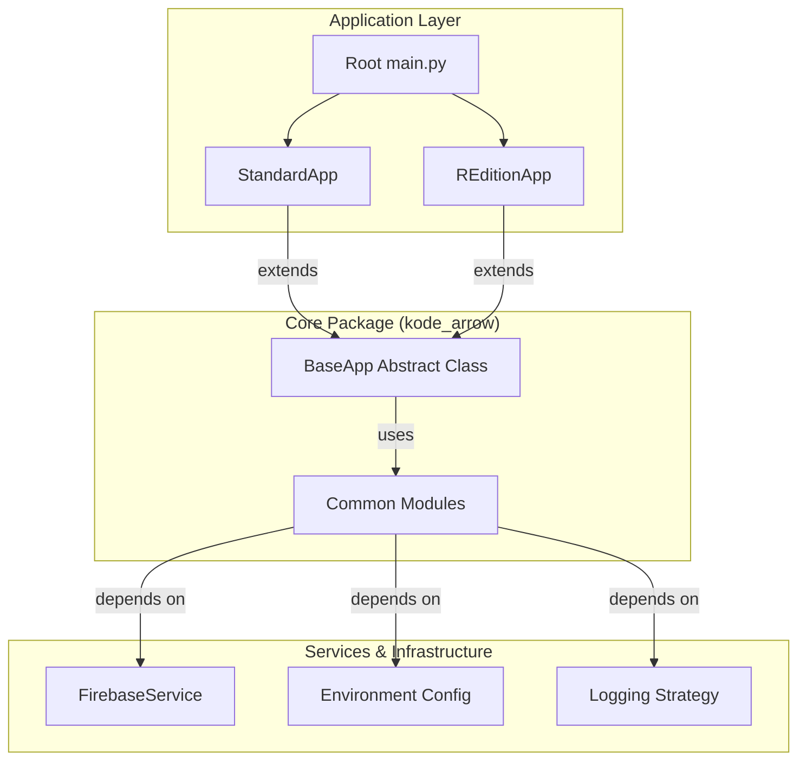

# KodeArrow Architectural Specification

## Design Philosophy
KodeArrow is built on the principles of **High Cohesion** and **Loose Coupling**. The system is divided into independent domains that communicate through strictly defined interfaces.

## System Architecture

## Layer Definitions

### 1. Application Layer (`kode_arrow/versions/`)
Contains the concrete implementations of the application. 
- **Standard Edition**: Optimized for end-user productivity.
- **R-Edition**: Optimized for data collection and research.

### 2. Core Logic (`kode_arrow/common/core/`)
Contains the `BaseApp` abstract class which enforces the lifecycle of the application (Startup -> Hotkey Setup -> Tray Setup -> Run).

### 3. Services Layer (`kode_arrow/common/services/`)
Encapsulates external dependencies. The `FirebaseService` handles all network and database logic, isolating it from the UI and core engine.

### 4. Utilities & Config (`kode_arrow/common/utils/` & `config/`)
Provides cross-cutting concerns like hardware identification, encryption, logging, and environment configuration.

## Scalability Strategy
To add a new edition of KodeArrow:
1. Create a new folder in `kode_arrow/versions/`.
2. Inherit from `BaseApp`.
3. Implement `setup_hotkeys()` and `setup_tray()`.
4. Register the version in the root `main.py`.
