# Footprints of Synthetic Sound

## A forensic taxonomy of how AI-generated, AI-transformed and AI-processed audio leaves detectable, attributable and provenance-bearing traces

**Status of evidence:** literature, documentation, code and reporting available up to 29 September 2026.
**Scope:** speech, singing, music and environmental/sound-effect audio; fully generated, partially generated, voice-converted, AI-edited and AI-enhanced material; traces in the signal, in derived representations, in files and containers, in pipelines, on platforms and in external records.

---

## 0. How to read this document

### 0.1 What this review is and is not

This is an investigation report, not a tutorial. It tries to answer one question as completely as the public evidence allows:

> What are all the technically meaningful ways, currently known or reasonably demonstrated, through which AI-generated or AI-processed audio can leave a footprint that supports detection, attribution, provenance, authentication or forensic reasoning?

The taxonomy in Part II was built _from_ the evidence gathered, then challenged in several gap-finding passes (Part IX records what each pass changed). Every mechanism in Parts III–VI is documented with the 21-field structure requested, but fields are left explicitly empty ("Not publicly established") rather than filled by conjecture.

### 0.2 Seven tasks that must not be conflated

| Task                    | Question it answers                                                                                                                                                  | Typical evidence                                                                                             | Typical failure                                                    |
| ----------------------- | -------------------------------------------------------------------------------------------------------------------------------------------------------------------- | ------------------------------------------------------------------------------------------------------------ | ------------------------------------------------------------------ |
| **Detection**           | Is this audio (or a segment of it) AI-generated/synthetic?                                                                                                           | Passive artifacts, watermarks, metadata                                                                      | High in-domain accuracy, collapse out-of-domain                    |
| **Attribution**         | Which generator family, system, model or version produced it?                                                                                                        | Architecture fingerprints, learned source-tracing embeddings, keyed watermark payloads, provider classifiers | Closed-set assumption; unseen generators forced into known classes |
| **Provenance**          | Where did this file/content come from, through which hands and tools?                                                                                                | Signed manifests, supply-chain metadata, registries, platform traces, codec history                          | Stripping, re-encoding, forged or self-signed claims               |
| **Authentication**      | Has the content been altered relative to a claimed original?                                                                                                         | Hard-bound hashes, ENF continuity, splice boundaries, fragile marks                                          | Legitimate processing indistinguishable from tampering             |
| **Fingerprinting**      | Which characteristics identify a generating or processing pipeline? (Also, in the music industry, _content_ fingerprinting = perceptual hashing for identification.) | Spectral peak patterns, residuals, encoder statistics; perceptual hashes                                     | Two meanings of the word are routinely mixed up                    |
| **Watermark detection** | Is a specific intentionally embedded signal present (and what payload does it carry)?                                                                                | Keyed detector output, bit accuracy, localization map                                                        | Removal, overwriting, forgery, key leakage                         |
| **Forensic analysis**   | What does the totality of evidence support, and how strongly?                                                                                                        | Combination of all of the above, ideally with calibrated likelihood ratios                                   | Treating correlated weak cues as independent                       |

Two further tasks recur in the literature and are kept separate here: **localization** (which time spans are synthetic or edited) and **characterization** (what _kind_ of processing occurred — e.g., "enhanced", "codec-resynthesized", "voice-converted" — without claiming synthetic origin).

### 0.3 Evidence grades used throughout

| Grade  | Meaning                                                                                                                                                           |
| ------ | ----------------------------------------------------------------------------------------------------------------------------------------------------------------- |
| **E1** | Independently replicated: multiple independent studies/benchmarks, or independent reproduction of a published method with public code/data                        |
| **E2** | Peer-reviewed primary study (venue noted); public code/data noted where available                                                                                 |
| **E3** | Primary study available only as a preprint (many 2025–2026 results fall here)                                                                                     |
| **E4** | Official documentation by the vendor, standards body or regulator describing its own system or rule (self-description; not independent validation)                |
| **E5** | Independent technical analysis, reverse engineering, investigative journalism, dissertation/thesis work, or allegations in legal filings (flagged as allegations) |
| **E6** | Community observation, tertiary summary, or commercial blog (flagged where the author has a commercial interest, e.g., sells a "watermark remover")               |
| **E7** | Inference or hypothesis by this review, derived from documented facts; not empirically validated in any source found                                              |

Where sources disagree, both are stated and the likely cause of disagreement (methodological, version-related, interpretive) is noted.

### 0.4 Notation

`f_s` sampling rate; `k` or `s` upsampling stride; STFT `X(t,f)`; bicoherence `b(f1,f2)`; EER equal error rate; TPR/FPR true/false positive rate; AUC area under ROC; LR likelihood ratio; SSL self-supervised learning representation (wav2vec 2.0/XLS-R, WavLM, HuBERT, Whisper encoder, BEATs, EAT, MERT); RVQ residual vector quantization; CoSG codec-based speech generation; CoRS codec re-synthesized speech.

---

## Executive summary: the twelve findings that matter most

1. **Footprints come in ten families, and most of them are not created by the "model" in the colloquial sense.** Upsampling layers in decoders and vocoders, resamplers, encoders and export libraries, platform transcoders, downstream enhancement tools and even the provider's own watermark each leave distinct traces in files that are "AI-generated". Pipeline-stage attribution (Part I) is therefore the first analytic step, not an afterthought.

2. **The strongest passive fingerprint currently understood is architectural, not learned.** Transposed-convolution ("deconvolution") upsamplers periodize the spectrum of their input and imprint small spectral peaks at predictable frequencies that depend on the stride chain, not on training data or weights; a 10k-parameter logistic regression on an averaged, detrended spectrum reaches ≥99% on several open and commercial generators ([R1], E2/E3 with public code). Consequence: such evidence attributes to an _architecture family_ (possibly shared by many products), and it is fragile to frequency-scaling manipulations (pitch/speed change, resampling) ([R3], [R4]).

3. **Watermarking is not one technique.** At least seven mechanistically different families exist (classical DSP; post-hoc neural residual with sample-level localization; post-hoc neural with explicit synchronization; time–frequency/psychoacoustic; generator-integrated; training-data-borne "radioactive"; audible disclosures). They differ in where the signal lives, how synchronization is achieved, who holds the detector and what attacks remove them. A systematic evaluation of 22 schemes against 109 attack configurations found no scheme robust to all attacks ([R22]); generative speech enhancement after mild noise removes most current neural watermarks ([R24]); overwriting attacks replace a legitimate mark with a forged one at close to 100% success ([R26]).

4. **2026 is the year provenance became regulated infrastructure.** EU AI Act Article 50 transparency duties apply from 2 August 2026, with a final Code of Practice (10 June 2026) asking providers for at least two machine-readable layers — signed, time-stamped metadata and an imperceptible watermark — plus free detection interfaces and an interoperability mechanism by 2 February 2027 ([R10]). California's SB 942 (as amended by AB 853) became operative the same day, requiring latent disclosures (provider, system name/version, time, unique ID) and a free public detection tool ([R41]). China's GB 45438-2025 has mandated explicit and implicit AIGC labels since 1 September 2025, including a Morse-code "AI" rhythm cue for audio ([R40]). Deployments followed: Suno documents C2PA Content Credentials on generated songs ([R36]); Microsoft documents C2PA plus watermarking for Azure AI Speech output ([R35]); ElevenLabs documents a SynthID-based watermark with a classifier fallback ([R34]); Google reports SynthID on audio from Lyria/Gemini ([R33]).

5. **Provider-scoped detection is now the most reliable form of detection — and the most fragmented.** Keyed watermark detectors only recognize their own provider's marks; Google's verification tools state they cannot yet read the SynthID-based marks ElevenLabs embeds ([R34]), and Gemini's verification recognizes only Google-generated content ([R33]). A negative result from any one provider's detector is weak evidence of human origin.

6. **Watermarks create a new failure mode in passive detectors.** When synthetic training data is watermarked by default and human data is not, detectors learn "watermark ⇒ fake". Stamping a watermark onto genuine speech raised one commercial detector's false-positive rate from 4% to 13% and, in a controlled study, flagged 58% of real recordings as fake versus 0.3% for controls ([R27]). Intentional and unintentional footprints are therefore _not statistically independent_ in deployed systems.

7. **Attribution exists in three granularities with very different reliability.** (i) Closed-world _engine_ identification (e.g., the vendor claim that the January 2024 Biden robocall matched ElevenLabs with >99% likelihood among ~120 engines, followed by a reported account suspension) ([R64], E5); (ii) open-set _source tracing_ of acoustic-model/vocoder/codec components on research protocols ([R51], [R54]); (iii) _keyed_ attribution through watermark payloads or provider logs. Only (iii) supports statements about a specific model version or account, and only with provider cooperation.

8. **Laboratory accuracy does not transfer to distribution.** Open-source audio detectors lost on average 48% AUC on in-the-wild 2024 deepfakes; the best commercial audio system reached ~0.89 accuracy ([R42]). AI-music detectors built for streaming fall below 60% F1 when music is short or under speech in TV broadcast ([R76]). Neural speech enhancement caused one pretrained detector to label 82% of enhanced _real_ speech as fake ([R61]).

9. **Physical-plausibility and identity cues fail in different ways from artifact cues** — which is exactly why they are valuable in combination. Vocal-tract reconstruction ([R45]), breath statistics ([R47]), person-of-interest speaker verification ([R50]) and source-speaker tracing in voice conversion ([R49]) do not depend on a specific generator's artifacts, but require clean speech, references, or assumptions that newer generators can learn to satisfy.

10. **Training-data footprints reveal training provenance, not generator identity.** Memorized producer tags and vocal signatures in generated songs have been presented as evidence of training on specific catalogs in litigation (allegations, not findings) ([R66]); training-data watermarks can propagate into generated outputs ([R18], [R19]); influence-attribution methods estimate which training items shaped an output ([R68]).

11. **Combination is necessary, but the signals are correlated.** Bandwidth, codec history, silence padding and watermark presence are all partly determined by the same pipeline choices; dataset shortcuts (e.g., leading-silence duration alone gave up to 85% accuracy on ASVspoof 2019 ([R43])) show how easily correlated cues masquerade as independent evidence. Calibrated, dependence-aware fusion is rare in published systems.

12. **The largest open gaps** are: open-set attribution after laundering; hybrid human/AI mixtures and partial edits; non-speech audio; independent evaluation of commercial detectors; and interoperable cross-provider detection (the EU interoperability deadline is 2 February 2027).

---

## Part I. The pipeline model: where footprints are born

A footprint observed in an AI-associated file is evidence about _some_ stage of a pipeline. The following stage model is used in every dossier (field 11, "Pipeline stage of origin").

```mermaid
flowchart LR
  S0[S0 Training data & training] --> S2
  S1[S1 Conditioning: text, lyrics, style, reference voice] --> S2
  S2[S2 Generative core: AR token LM / diffusion / flow / GAN / VC mapping] --> S3
  S3[S3 Sampling & inference: temperature, steps, guidance, windowing, continuation] --> S4
  S4[S4 Latent→waveform: codec decoder / VAE decoder / vocoder / iSTFT] --> S5
  S5[S5 Marking: post-hoc watermark, audible disclaimer] --> S6
  S6[S6 Service post-processing: resample, normalize, limit, mix] --> S7
  S7[S7 Export: encoder, container, metadata, C2PA signing, filename] --> S8
  S8[S8 User editing: DAW, stems, enhancement, pitch/tempo] --> S9
  S9[S9 Distribution intake: distributor metadata, registries, detectors] --> S10
  S10[S10 Platform processing: transcode, loudness, strip/rewrite metadata, labels] --> S11
  S11[S11 Delivery/capture: download, stream-rip, phone line, broadcast, re-recording] --> S12
  S12[S12 Analysis: examiner preprocessing can itself destroy or create cues]
```

| Stage              | Footprints it can introduce (families, see Part II)                                                                                             | Footprints it tends to destroy                     |
| ------------------ | ----------------------------------------------------------------------------------------------------------------------------------------------- | -------------------------------------------------- |
| S0 Training        | Memorized content, radioactive watermarks, dataset bandwidth/codec imprints, stylistic/identity priors (F, A6, C7)                              | —                                                  |
| S1 Conditioning    | Prompt-environment leakage in zero-shot cloning; source-speaker leakage in VC; LLM-written lyrics/scripts (E)                                   | —                                                  |
| S2 Core model      | Distributional/over-smoothing statistics; prosody/breath/vocal-tract implausibility; learned latent traces (C6, C11, D)                         | —                                                  |
| S3 Sampling        | Continuation seams, instabilities, long-range structure anomalies (C10) — weakly evidenced                                                      | —                                                  |
| S4 Decoding        | Upsampler periodization peaks, filtering artifacts, phase-reconstruction traces, codec-family signatures, quantization manifold (C1–C5, C8, C9) | —                                                  |
| S5 Marking         | Watermarks, audible disclaimers (A)                                                                                                             | Can mask or confound passive cues ([R27], [R28])   |
| S6 Post-processing | Resampling transition bands, normalization/limiting histograms (G1, G2)                                                                         | Band-limited artifacts above new Nyquist           |
| S7 Export          | Encoder/container signatures, vendor tags, C2PA manifests, mandated labels (G3, B)                                                              | High-frequency detail (lossy codecs)               |
| S8 User editing    | Splice boundaries, hybrid stems, enhancement/VC layers (G5, G6)                                                                                 | Frequency-scaled artifacts (pitch/tempo), metadata |
| S9 Intake          | Declarations (DDEX), registry fingerprints, detector labels (B2, B5)                                                                            | —                                                  |
| S10 Platform       | Transcoding history, loudness normalization, metadata stripping patterns, platform labels (H)                                                   | Metadata; fragile marks; some passive peaks        |
| S11 Capture        | Telephony band-limiting and codecs; room/loudspeaker traces from replay; broadcast mixing (H, D7)                                               | Most fine spectral cues                            |
| S12 Analysis       | Resampling to 16 kHz for detectors (discarding >8 kHz cues), trimming, normalization                                                            | Cues outside analysis band                         |

**Practical rule (E7, derived from the above):** before interpreting any cue, an examiner should establish the _last_ lossy or resampling stage, because every cue produced upstream of it is filtered through it.

---

## Part II. The taxonomy at a glance

Legend for "Reveals": **D** detection, **A** attribution (granularity in brackets), **P** provenance, **Au** authentication/alteration, **L** localization, **C** characterization of processing.
"Distribution survival": qualitative summary of Part VI; Yes usually survives typical platform processing, ◐ survives some pipelines, No usually lost.

| ID                                                    | Mechanism                                                                                                                 | Where it lives                                          | Stage of origin               | Reveals                                 | Distribution survival            | Best evidence                                    |
| ----------------------------------------------------- | ------------------------------------------------------------------------------------------------------------------------- | ------------------------------------------------------- | ----------------------------- | --------------------------------------- | -------------------------------- | ------------------------------------------------ |
| **A — Intentional in-signal marks**                   |                                                                                                                           |                                                         |                               |                                         |                                  |                                                  |
| A1                                                    | Classical DSP watermarks (spread-spectrum, patchwork, echo, QIM, phase) incl. legacy broadcast/audience-measurement marks | Waveform/transform coefficients                         | S5, S9                        | D, P, A[keyed]                          | ◐                                | E2 (decades of literature)                       |
| A2                                                    | Post-hoc neural residual watermark with sample-level localization (AudioSeal family)                                      | Additive waveform residual                              | S5                            | D, L, A[16-bit payload]                 | ◐                                | E1–E2 [R11], [R22], [R23]                        |
| A3                                                    | Post-hoc neural watermark with explicit synchronization (WavMark, IDEAW, XAttnMark)                                       | Residual in 1-s segments + sync pattern                 | S5                            | D, A[payload], L[coarse]                | ◐                                | E2 [R12], [R31]                                  |
| A4                                                    | Time–frequency / psychoacoustic neural watermarks (Timbre, SilentCipher, PerTh, SynthID-audio, MelShield)                 | STFT/mel magnitude, masked bands                        | S5                            | D, A[keyed], L                          | ◐                                | E2 [R13], [R14]; E4 [R15], [R33]                 |
| A5                                                    | Generator-integrated watermarks (diffusion-integrated, codec-integrated, vocoder-injected, token-level)                   | Inside generation/decoding                              | S2–S4                         | D, A[model]                             | ◐                                | E2–E3 [R21], [R25], [R94], [R95]                 |
| A6                                                    | Training-data-borne ("radioactive") watermarks                                                                            | Learned by model, re-emitted in outputs                 | S0                            | P[training data], A[model lineage]      | ◐                                | E2 [R18]; E3 [R19], [R20]                        |
| A7                                                    | Audible disclosures (spoken disclaimers, "AI" Morse rhythm)                                                               | Perceptible audio                                       | S5                            | D (human-readable)                      | Yes unless edited out            | E4 [R17], [R40], [R10]                           |
| **B — Intentional out-of-signal provenance**          |                                                                                                                           |                                                         |                               |                                         |                                  |                                                  |
| B1                                                    | C2PA manifests (hard-bound, signed)                                                                                       | Container: ID3 GEOB, RIFF `C2PA` chunk, BMFF `uuid` box | S7                            | P, Au, D, A[provider/system/version]    | No (stripped by re-encode/upload)| E4 [R38], [R36], [R35]                           |
| B2                                                    | Soft bindings & first-party registries (watermark/fingerprint → manifest/registry lookup)                                 | External repository keyed by signal                     | S7, S9                        | P, D                                    | ◐                                | E4 [R38], [R37]                                  |
| B3                                                    | Mandated implicit labels (GB 45438 `AIGC` field; CA latent disclosure)                                                    | Metadata (+ optional watermark)                         | S7                            | D, P                                    | No/◐                             | E4 [R40], [R41]                                  |
| B4                                                    | Vendor/tool metadata and export defaults (comments, URLs, encoder tags, format presets)                                   | ID3/RIFF/MP4 tags; file parameters                      | S7                            | D, A[service]                           | No                               | E5–E6 [R89], [R120]                              |
| B5                                                    | Supply-chain declarations & platform labels (DDEX AI credits, platform tags)                                              | Distribution metadata, platform UI                      | S9–S10                        | D (declared), P                         | Yes within platform              | E4 [R65]                                         |
| B6                                                    | Provider-side records & closed-world provider detectors                                                                   | Provider infrastructure                                 | S2–S7                         | A[account/model], D                     | Yes if provider cooperates       | E4 [R34], [R35], [R33]; E5 [R64]                 |
| **C — Unintentional generator/decoder artifacts**     |                                                                                                                           |                                                         |                               |                                         |                                  |                                                  |
| C1                                                    | Upsampler-induced spectral structure (transposed/subpixel periodization peaks; interpolation filtering/imaging)           | Long-term average spectrum fine structure               | S4                            | D, A[architecture family]               | ◐ (fragile to frequency scaling) | E2 [R2]; E2/E3 [R1] (code)                       |
| C2                                                    | Phase-reconstruction and mel-inversion traces                                                                             | Phase/group delay, harmonic detail                      | S4                            | D, A[vocoder class]                     | ◐                                | E2–E3 [R3], [R83]                                |
| C3                                                    | Higher-order spectral (bispectral) anomalies                                                                              | Bicoherence magnitude/phase                             | S2–S4                         | D                                       | ◐                                | E2 [R46]                                         |
| C4                                                    | Residual-domain fingerprints (LPC short/long-term prediction residuals; filtered-residual averages)                       | Residual/error signal                                   | S2–S4                         | D, A[model]                             | ◐                                | E2 [R79]; E3 [R53]                               |
| C5                                                    | Distributional and over-smoothing statistics (first-digit laws, spectral variance)                                        | Coefficient statistics                                  | S2                            | D                                       | ◐                                | E2 [R80]                                         |
| C6                                                    | Bandwidth / native-sample-rate imprint                                                                                    | High-frequency roll-off, empty bands                    | S0, S4, S6                    | D (weak), A[pipeline], C                | ◐                                | E2 [R1], [R59]; E3 [R86]                         |
| C7                                                    | Vocoder/codec-family signatures learned by classifiers (incl. codec taxonomy)                                             | Learned spectro-temporal features                       | S4                            | A[component], D                         | ◐                                | E2 [R82]; E3 [R51], [R52]                        |
| C8                                                    | Quantization/tokenization manifold (codec reconstruction proxy; mu-law lattices)                                          | Sample/latent lattice                                   | S4                            | D, A[codec]                             | ◐                                | E2 [R3]; E7 (idempotence)                        |
| C9                                                    | Inference/sampling-procedure traces (seams, instabilities, long-range structure)                                          | Temporal structure                                      | S3                            | D                                       | ◐                                | E2–E3 [R5]; mostly E6/E7                         |
| C10                                                   | Latent traces in SSL/foundation representations (what most detectors use)                                                 | Learned embedding space                                 | S2–S4 (mixed)                 | D, C, A                                 | ◐                                | E1 (benchmarks) [R44], [R71]                     |
| **D — Physical-production and capture plausibility**  |                                                                                                                           |                                                         |                               |                                         |                                  |                                                  |
| D1                                                    | Vocal-tract / articulatory implausibility                                                                                 | Formant/area-function estimates                         | S2                            | D                                       | ◐                                | E2 [R45]                                         |
| D2                                                    | Respiration and non-verbal events                                                                                         | Breath events, spacing                                  | S2                            | D                                       | ◐                                | E2 [R47]                                         |
| D3                                                    | Prosody, timing, pause and voice-quality statistics                                                                       | F0, durations, jitter/shimmer                           | S2                            | D, A[prosodic signature]                | ◐                                | E2–E3 [R54 refs]                                 |
| D4                                                    | Emotion/paralinguistic–semantic coherence                                                                                 | Affect embeddings vs content                            | S2                            | D                                       | ◐                                | E2 (Conti et al. 2022)                           |
| D5                                                    | Acoustic-environment and scene consistency                                                                                | Reverberation, noise floor, scene                       | S1–S2, S8                     | D, Au, L                                | ◐                                | E2 [R63]; E3 (ESDD2)                             |
| D6                                                    | Electric-network-frequency (ENF) presence/consistency                                                                     | 50/60 Hz hum and harmonics                              | Capture (absent in synthesis) | Au, P[time/grid], D (negative evidence) | ◐                                | E1 (ENF for authentication) [R48]; E7 for AI use |
| D7                                                    | Device/channel/replay traces                                                                                              | Microphone/channel response, loudspeaker/room           | S11                           | P, Au, D                                | ◐                                | E2–E3 [R103], [R110]                             |
| D8                                                    | Cross-modal audio–visual coherence                                                                                        | Lip–audio sync, face–voice identity                     | S2 (joint A/V)                | D, Au                                   | ◐                                | E2 [R50]                                         |
| **E — Identity and content-level footprints**         |                                                                                                                           |                                                         |                               |                                         |                                  |                                                  |
| E1                                                    | Person-of-interest identity inconsistency                                                                                 | Speaker embedding vs references                         | S1–S2                         | D, Au                                   | Yes (robust to codecs)           | E2 [R50]                                         |
| E2                                                    | Source-speaker leakage in voice conversion                                                                                | Residual source identity                                | S1 (VC)                       | A[human operator]                       | ◐                                | E2 [R49]                                         |
| E3                                                    | Prompt/reference-environment leakage in zero-shot cloning                                                                 | Reverberation/noise copied from prompt                  | S1                            | P[reference recording]                  | ◐                                | E2 [R73] (phenomenon); E7 (forensic use)         |
| E4                                                    | Preset/stock-voice identity matching                                                                                      | Speaker identity of catalog voices                      | S1                            | A[service]                              | Yes                              | E5 [R64]; E7                                     |
| E5                                                    | Linguistic/semantic content (LLM lyrics/scripts; transcript features)                                                     | ASR transcript                                          | S1 (upstream LLM)             | D                                       | Yes                              | E2 [R69]                                         |
| E6                                                    | Musical-structural traces                                                                                                 | Long-range song structure                               | S2–S3                         | D                                       | ◐                                | E2 [R5]; E3 [R85]                                |
| **F — Training-data footprints**                      |                                                                                                                           |                                                         |                               |                                         |                                  |                                                  |
| F1                                                    | Memorized/regurgitated training material (producer tags, melodies, vocal signatures)                                      | Musical/lexical content                                 | S0                            | P[training data], D                     | Yes                              | E5 (allegations) [R66]; E3 [R67]                 |
| F2                                                    | Training-data influence attribution                                                                                       | Embedding similarity / counterfactual influence         | S0                            | P[training data]                        | Yes                              | E2 [R68]                                         |
| **G — Pipeline-component (non-generator) footprints** |                                                                                                                           |                                                         |                               |                                         |                                  |                                                  |
| G1                                                    | Resampler traces                                                                                                          | Transition band, periodic correlations                  | S6, S8, S12                   | C, A[pipeline]                          | ◐                                | E2 [R75]; E7 (library ID)                        |
| G2                                                    | Level processing and quantization (normalization, limiting, dither)                                                       | Sample-value histogram                                  | S6–S7                         | C                                       | ◐                                | E1 (classic forensics); E7 (AI-specific)         |
| G3                                                    | Encoder and container structure                                                                                           | Bitstream syntax, tags, chunk layout                    | S7, S10                       | P, A[software]                          | No/◐                             | E2 [R56]; E4 [R48]                               |
| G4                                                    | Codec history / transcoding                                                                                               | MDCT statistics, framing grid, cutoffs                  | S7–S11                        | P, Au, C                                | ◐                                | E2 [R57], [R58], [R59]                           |
| G5                                                    | Downstream AI processing layers (enhancement, restoration, separation, VC, neural VoIP codecs)                            | Learned-processing artifacts                            | S8, S11                       | C (confounder for D)                    | ◐                                | E3 [R61], [R62]; E4 [R74]                        |
| G6                                                    | Splice/partial-synthesis/edit boundaries and hybrid stems                                                                 | Local discontinuities                                   | S8                            | L, Au, D                                | ◐                                | E2 (PartialSpoof); E3 [R78], [R101]              |
| G7                                                    | Frame-grid and sample-count regularities                                                                                  | File length, padding, grid alignment                    | S4, S7                        | A[pipeline]                             | No                               | E7 only                                          |
| **H — Distribution and platform footprints**          |                                                                                                                           |                                                         |                               |                                         |                                  |                                                  |
| H1                                                    | Platform transcoding/provenance traces                                                                                    | Codec parameters, band limits                           | S10                           | P[platform]                             | n/a (is the trace)               | E5; adjacent E2 (images/video)                   |
| H2                                                    | Metadata survival/stripping patterns                                                                                      | Presence/absence of tags                                | S10                           | P                                       | n/a                              | E4 [R10], [R41]                                  |
| H3                                                    | Telephony and broadcast channel conditions                                                                                | Narrowband codecs, mixing                               | S11                           | P, confounder                           | n/a                              | E2 [R44]; E3 [R76]                               |
| H4                                                    | Behavioral/catalog-level signals                                                                                          | Upload/stream patterns, catalog anomalies               | S9–S10                        | D (ecosystem-level)                     | Yes within platform              | E4 [R6], [R65]                                   |

Two cross-cutting analyses are treated separately because they are not footprints themselves but determine how footprints can be used: **combination and dependence** (Part VII) and **anti-forensics and confounders** (within Part VI).

### Why these are separate families (differentiation criteria)

- **A vs B:** A lives _in the samples_ (survives format conversion if robust); B lives _next to the samples_ (survives only if the container or an external registry survives).
- **A vs C:** A is intentionally keyed and has a defined null hypothesis (unmarked audio yields near-chance detector output); C is an unintended by-product with no designed null model, so false-positive behaviour must be estimated empirically.
- **C vs D:** C asks "does the signal carry traces of a specific _synthesis machinery_?"; D asks "is the signal consistent with a _physical production and capture process_?" C evidence becomes obsolete when architectures change; D evidence becomes obsolete when generators learn to model physiology and acoustics.
- **D vs E:** D concerns generic physical plausibility; E concerns a _specific identity or specific content_ and usually requires reference material or external knowledge.
- **E vs F:** E concerns the current output's identity/content; F concerns _what the model was trained on_.
- **C vs G:** both are unintended, but G is produced by _general-purpose_ signal-processing components that also touch human audio, so G can never, by itself, establish synthetic origin — it characterizes processing and pipeline.
- **G vs H:** G is introduced by the producer's or editor's tools; H by intermediaries during distribution; the distinction matters for provenance chains and for the "last lossy stage" rule.

<!--NEXT-->
