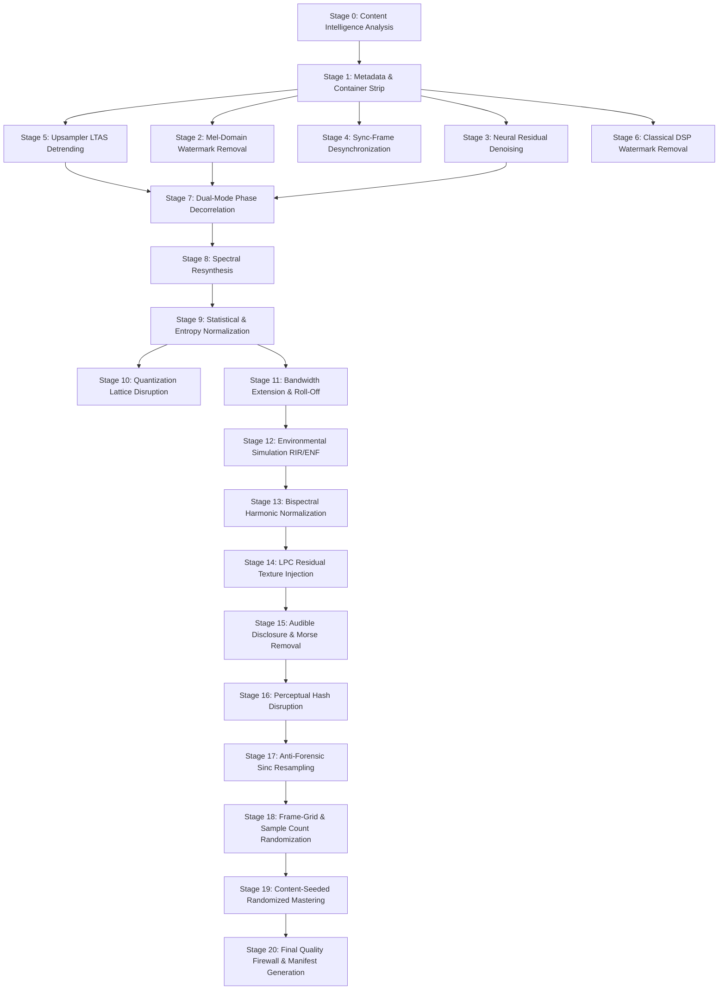

# NaSuno Master Evasion Plan v4 (Definitive Specification)

## The Definitive Engineering Specification for Inaudible AI Audio Footprint Annihilation

> **Authoritative Baseline:** Incorporates the 40+ footprint forensic taxonomy ([forensic-taxonomy.md](forensic-taxonomy.md)), verified psychoacoustic boundaries ([psychoacoustics-reference.md](psychoacoustics-reference.md)), critical audit corrections ([plan-audit-and-corrections.md](plan-audit-and-corrections.md)), and the production implementation guide ([implementation-plan.md](implementation-plan.md)).
>
> **The Core Philosophy:**
> *What does the forensic machine measure that the human auditory system cannot perceive?*
> That mathematical gap is our operating theater. We do not attempt to make synthetic audio "sound analog" through heavy coloration. We surgically eliminate the machine-detectable signatures within the biological blind spots of human hearing, backed by 180 years of auditory research (from Ohm 1843 to ISO 226:2023).

---

## Part I. The Perception-Detection Gap & Core Laws

### 1.1 The Minimum-Change Principle

```
Objective:   maximize  D(M)       -- detector-feature disruption across all 40+ footprint types
Subject to:  P(M) = 0             -- human-perceived change is strictly below Just Noticeable Difference (JND)
Preference:  minimize |M|         -- smallest perturbation in sample/spectral space that achieves D(M) > threshold
```

### 1.2 Feature-Space Operating Matrix

Every signal feature utilized by classifiers, watermarking decoders, and forensic tools is mapped against human perceptual tolerance:

| Feature | Detector Sensitivity | Perceptual Relevance | Gap Width | Primary Strategy |
|---------|---------------------|---------------------|-----------|------------------|
| Phase coherence (>3 kHz, steady-state) | HIGH | ZERO | MAXIMUM | Full random replacement (P1) |
| Phase coherence (>3 kHz, transients) | HIGH | MODERATE | MODERATE | Group phase delay offset only (P5) |
| Phase coherence (1–3 kHz, steady-state) | HIGH | LOW | LARGE | Controlled perturbation <0.5 rad (P2) |
| Phase coherence (<1 kHz) | HIGH | VERY HIGH | ZERO/NEGATIVE | Strictly preserved (<0.26 rad jitter) |
| Spectral periodicity (LTAS peaks) | VERY HIGH | ZERO | MAXIMUM | LTAS detrending + harmonic-safe comb notch |
| Mel-spectrogram anomalies | VERY HIGH | LOW | LARGE | Median smoothing + ISO 226 masking ceiling |
| Neural residual (waveform noise) | VERY HIGH | ZERO | MAXIMUM | Tiered denoising + pink noise dithering |
| Sync frame repetition (1 Hz) | HIGH | ZERO | MAXIMUM | Phase-vocoder sinusoidal time drift + micro-crop |
| Sample-value histogram lattice | MODERATE | ZERO | LARGE | Sub-LSB TPDF dither + soft-knee tanh compression |
| Quantization manifold clustering | MODERATE | ZERO | LARGE | DCT coefficient TPDF dithering |
| LPC residual kurtosis (speech) | MODERATE | ZERO | LARGE | Residual micro-texture injection at -40 dB |
| Spectral variance (over-smoothing) | MODERATE | LOW | MODERATE | Proportional variance injection (>0.12 min) |
| Native bandwidth roll-off (>60 dB/oct) | MODERATE | LOW | MODERATE | Shaped comfort noise at cutoff -20 dB |
| Higher-order bispectral coupling | MODERATE | ZERO | LARGE | Gentle cubic/quintic saturation (THD < 0.1%) |
| Acoustic environment traces (RIR/ENF) | MODERATE | LOW | LARGE | 3-8% synthetic RIR + Brownian ENF at floor -3 dB |
| Container metadata & C2PA manifests | VERY HIGH | ZERO | MAXIMUM | Targeted binary chunk & tag destruction |
| Perceptual acoustic hash (Chromaprint) | HIGH | LOW | MODERATE | 3-cent pitch shift + micro-drift + stuttering |
| Pipeline resampling signatures | MODERATE | ZERO | LARGE | Polyphase sinc 48 kHz round-trip |
| Sample-count frame-grid alignment | LOW | ZERO | LARGE | 1-64 zero-crossing sample padding |
| Static mastering signature | HIGH | LOW | LARGE | Content-hash seeded parameter randomization |

---

## Part II. The Content Intelligence Engine

### 2.1 Architecture: Analyzer Registry & Typed Sub-Profiles

To eliminate monolithic coupling, analyzers are isolated plugins implementing `ContentAnalyzer`. Each analyzer produces a strongly typed sub-profile stored in `ContentProfile`.

```python
from typing import Protocol, TypeVar, Type, Optional, Any, Dict
import numpy as np

T = TypeVar("T")

class ContentAnalyzer(Protocol):
    """Protocol for independent content analyzer plug-ins."""
    def analyze(self, audio: np.ndarray, sr: int) -> Any: ...

class ContentProfile:
    """Type-safe container for analyzer sub-profiles."""
    def __init__(self) -> None:
        self._profiles: Dict[Type[Any], Any] = {}

    def get(self, profile_type: Type[T]) -> Optional[T]:
        return self._profiles.get(profile_type)

    def set(self, profile: Any) -> None:
        self._profiles[type(profile)] = profile

class AnalyzerRegistry:
    """Dispatches analysis suite and populates ContentProfile."""
    def __init__(self) -> None:
        self._analyzers: Dict[Type[Any], ContentAnalyzer] = {}

    def register(self, analyzer: ContentAnalyzer, result_type: Type[Any]) -> None:
        self._analyzers[result_type] = analyzer

    def analyze_all(self, audio: np.ndarray, sr: int) -> ContentProfile:
        profile = ContentProfile()
        for res_type, analyzer in self._analyzers.items():
            try:
                res = analyzer.analyze(audio, sr)
                profile.set(res)
            except Exception as e:
                # Fallback to graceful defaults on analyzer error
                profile.set(self._get_fallback(res_type))
        return profile
```

### 2.2 Analyzer Catalog & Fallback Behaviors

| Analyzer | Sub-Profile Dataclass | Key Fields | Fallback Behavior on Edge Cases |
|----------|----------------------|------------|---------------------------------|
| `NoiseFloorAnalyzer` | `NoiseFloorAnalysis` | `floor_dbfs: float`, `floor_per_band: np.ndarray` | Default to -96.0 dBFS (ultra-conservative) |
| `TransientAnalyzer` | `TransientAnalysis` | `transient_map: np.ndarray (bool)`, `onsets: np.ndarray`, `density: float` | Mark all frames as steady-state (no temporal masking over-exploitation) |
| `HarmonicAnalyzer` | `HarmonicAnalysis` | `f0_contour: np.ndarray`, `harmonic_bins: Dict[int, List[int]]`, `is_harmonic: bool` | Set `is_harmonic = False` (skip pitch-dependent notches) |
| `HPSeparationAnalyzer` | `HPAnalysis` | `harmonic_ratio_per_frame: np.ndarray`, `percussive_energy: float` | Treat content as 50/50 mixed |
| `BandwidthAnalyzer` | `BandwidthAnalysis` | `cutoff_hz: float`, `rolloff_db_oct: float`, `is_truncated: bool` | Assume full bandwidth (no noise injection) |
| `DensityAnalyzer` | `DensityAnalysis` | `density_class: str ("sparse", "moderate", "dense")`, `crest_factor: float` | Classify as "sparse" (tightest quality constraints) |
| `StereoAnalyzer` | `StereoAnalysis` | `is_stereo: bool`, `ms_ratio: float`, `correlation_per_band: np.ndarray` | Treat as mono or clamp correlation threshold to 0.98 |
| `DynamicAnalyzer` | `DynamicAnalysis` | `lufs: float`, `loudness_range: float`, `peak_dbfs: float` | Use standard -14 LUFS target |
| `PhaseCoherenceAnalyzer` | `PhaseAnalysis` | `inter_frame_variance: np.ndarray`, `coherent_bins: np.ndarray` | Assume natural variance (skip phase alteration) |
| `PeriodicityAnalyzer` | `PeriodicityAnalysis` | `periodic_peaks: List[Tuple[float, float]]`, `stride_family: Optional[str]` | Empty list (no upsampler attenuation) |
| `WatermarkScanner` | `WatermarkScanResult` | `detected_marks: List[str]`, `confidence: Dict[str, float]` | Empty (skip aggressive watermark attacks) |
| `VocalAnalyzer` | `VocalAnalysis` | `has_vocals: bool`, `vocal_frames: np.ndarray` | Assume `has_vocals = True` (protect vocal formant regions) |

### 2.3 Content-Adaptive Routing & Idempotency Check

1. **Idempotency Gate:** If `WatermarkScanner` detects 0 marks AND `PeriodicityAnalyzer` detects 0 periodic peaks AND `PhaseAnalysis` shows variance > 0.2 across all bands:
   - Emit notice: `"Audio exhibits natural or previously sanitized characteristics. Activating zero-risk passive normalization only."`
   - Bypass Stages [2], [3], [4], [5], [6], [8].
2. **Adaptive Level Selection (`auto` mode):**
   - `DensityAnalysis.density_class == "sparse"` -> Set processing level to `gentle`.
   - `DensityAnalysis.density_class == "moderate"` -> Set processing level to `moderate`.
   - `DensityAnalysis.density_class == "dense"` -> Set processing level to `aggressive`.

---

## Part III. The DAG-Based Pipeline Architecture

### 3.1 Directed Acyclic Graph (DAG) Protocol

Fixed sequential execution is replaced by a topological dependency graph. Stages declare dependencies, stage types, and parallelization capabilities:

```python
from typing import Protocol, Set, Tuple, Dict, Any, Literal
import numpy as np

class RemovalStage(Protocol):
    name: str
    stage_type: Literal["subtractor", "injector", "phase_modifier", "structural"]
    depends_on: Set[str]
    incompatible_with: Set[str]
    parallel_channels: bool  # True if L and R can be processed independently

    def should_activate(self, profile: ContentProfile) -> bool: ...
    def process(
        self,
        audio: np.ndarray,
        sr: int,
        budget: np.ndarray,
        profile: ContentProfile,
        strength: float = 1.0,
    ) -> Tuple[np.ndarray, Dict[str, Any]]: ...
```

### 3.2 Topological Stage Graph



### 3.3 Inter-Stage Fresh Budget Recomputation

Masking thresholds do not sum linearly. Modifying a signal changes its spectral energy distribution, rendering static masking budgets invalid for downstream stages.
- Between every active stage, the pipeline recomputes the perceptual masking budget on `current_audio`.
- STFT overhead: ~15ms per stage (225ms total for a 3-minute track).

---

## Part IV. The Quality Firewall Specification

### 4.1 Per-Critical-Band ISO 226 Validation Matrix

Global metrics (RMS, overall Pearson correlation) hide localized frequency damage. The Quality Firewall decomposes audio into 25 critical Bark bands and enforces frequency-dependent RMS tolerances:

| Bark Band | Center Freq (Hz) | Bandwidth (Hz) | Max RMS Delta Allowed (dB) | Auditory Rationale |
|-----------|------------------|----------------|----------------------------|--------------------|
| 1 | 50 | 0–100 | ±3.0 dB | Low ear sensitivity (ISO 226 threshold 40 dB SPL) |
| 2–4 | 150–350 | 100–400 | ±2.0 dB | Warmth region; moderate sensitivity |
| 5–8 | 500–1000 | 400–1080 | ±1.0 dB | High sensitivity zone |
| 9–13 | 1170–2000 | 1080–2320 | ±0.8 dB | Formant clarity region |
| 14–17 | 2500–3700 | 2320–4400 | **±0.5 dB** | **Maximum human ear sensitivity (acoustic canal resonance)** |
| 18–21 | 4400–7700 | 4400–9500 | ±1.5 dB | Sibilance and attack definition |
| 22–24 | 9500–13500 | 9500–15500 | ±3.0 dB | Upper harmonics; reduced human sensitivity |
| 25 | 17000 | >15500 | ±6.0 dB | Air band; rapid human high-frequency roll-off |

### 4.2 Content-Adaptive Global Invariants

| Metric | Sparse Audio (Solo, Classical) | Moderate Audio (Pop, Rock) | Dense Audio (EDM, Metal) | Violation Action |
|--------|--------------------------------|----------------------------|--------------------------|------------------|
| `cross_correlation` | **> 0.97** | **> 0.94** | **> 0.90** | Immediate Stage Rollback |
| `lufs_delta` | < 0.5 LU | < 0.8 LU | < 1.0 LU | Gain Re-normalization |
| `rms_delta_global` | < 2.0% | < 3.5% | < 5.0% | Immediate Stage Rollback |
| `peak_delta` | < 5.0% | < 7.5% | < 10.0% | Peak Limiter Clamp |
| `stereo_correlation` | > 0.98 | > 0.96 | > 0.94 | M/S Width Restoration |
| `nan_inf_count` | 0 | 0 | 0 | Hard Abort & Rollback |
| `clipping_count` | 0 (peak <= 1.0) | 0 (peak <= 1.0) | 0 (peak <= 1.0) | True-Peak Limiter Clamp |

### 4.3 Differentiated Protocol Gates

1. **`SignalSubtractor` Gate:**
   - Evaluates: `residual_energy = original_band - modified_band`.
   - Assert: No band energy drops below `NoiseFloorAnalysis.floor_per_band + 1.0 dB` (prevents artificial spectral black holes).
2. **`SignalInjector` Gate:**
   - Evaluates: `injected_energy = modified_band - original_band`.
   - Assert: Injected component remains below the Power-Law Masking Threshold `T_combined` at every bin.
   - Assert: Global noise floor is not elevated by more than +1.5 dB.
3. **`PhaseModifier` Gate:**
   - Assert: Magnitude spectrum delta between before and after is strictly `< 0.05 dB` across all bins (phase modification must never alter spectral envelope).

---

## Part V. The Minimum-Change Optimizer

### 5.1 Sampled Search with Non-Monotonicity Safeguards

Because some DSP modifications exhibit non-monotonic behavior (where high strengths induce secondary artifacts that re-trigger forensic detectors), naive binary search is prohibited.

```python
def optimize_stage_strength(
    stage: RemovalStage,
    audio: np.ndarray,
    sr: int,
    budget: np.ndarray,
    profile: ContentProfile,
    target_metric_fn: Callable[[np.ndarray], float],
    threshold: float,
) -> Tuple[np.ndarray, float]:
    """
    Evaluates 5 discrete strength anchor points [0.2, 0.4, 0.6, 0.8, 1.0].
    Finds the lowest passing strength and refines with local binary search.
    """
    strengths = [0.2, 0.4, 0.6, 0.8, 1.0]
    evaluated = {}

    for s in strengths:
        out, _ = stage.process(audio, sr, budget, profile, strength=s)
        metric = target_metric_fn(out)
        evaluated[s] = (out, metric)
        if metric < threshold:
            # First passing found in coarse grid
            break

    passing_strengths = [s for s, (out, m) in evaluated.items() if m < threshold]

    if not passing_strengths:
        # If none pass, pick the strength that achieved the minimum metric
        best_s = min(evaluated.keys(), key=lambda s: evaluated[s][1])
        return evaluated[best_s][0], best_s

    s_pass = min(passing_strengths)
    if s_pass == 0.2:
        return evaluated[0.2][0], 0.2

    # Refine between failing neighbor and s_pass
    failing_candidates = [s for s in evaluated.keys() if s < s_pass]
    s_fail = max(failing_candidates) if failing_candidates else 0.0
    s_mid = (s_fail + s_pass) / 2.0

    out_mid, _ = stage.process(audio, sr, budget, profile, strength=s_mid)
    if target_metric_fn(out_mid) < threshold:
        return out_mid, s_mid

    return evaluated[s_pass][0], s_pass
```

---

## Part VI. Complete Technical Algorithms for All 20 Stages

### Stage [1]: Binary Metadata & C2PA Container Stripping
- **Target:** C2PA manifests, ID3 tags, Vorbis comments, RIFF chunks, QuickTime user-data.
- **Algorithm:**
  - WAV: Parse RIFF chunk tree; excise `C2PA`, `c2pa`, `JUMBF`, and non-essential `INFO` chunks.
  - MP3: Parse ID3v2 frames; remove `GEOB` frames with MIME `application/c2pa` or owner `c2pa`. Remove `PRIV`, `TXXX` platform stamps.
  - MP4/M4A: Scan box hierarchy; excise `uuid` box matching `d8fec3d6-1b0e-483c-9297-5884e395a04e`.
  - Re-parse verification: Output container must return 0 bytes on all C2PA scanners.

### Stage [2]: Mel-Domain Watermark Neutralization
- **Target:** SynthID-audio, SilentCipher, Timbre watermark patterns embedded in mel-frequency bands.
- **Algorithm:**
  - Convert to 128-band Mel Spectrogram (`n_fft=2048`, `hop=512`).
  - Calculate running temporal median and Median Absolute Deviation (MAD) per band.
  - Detect anomaly spikes: `|mel[m, t] - median[m]| > 3.5 * MAD[m]`.
  - Compute ISO 226 masking curve for current frame.
  - Clamp flagged anomaly bins down to the psychoacoustic masking threshold (not below).
  - Apply harmonic-aware soft blending (70% original, 30% smoothed).
  - Reconstruct via pseudo-inverse mel matrix and combine with original STFT phase.

### Stage [3]: Tiered Neural Residual Denoising
- **Target:** AudioSeal, SynthID waveform residuals, neural speech generator residuals.
- **Algorithm:**
  - **Tier 1:** Spectral subtraction with oversubtraction factor `alpha=1.5`, spectral floor `beta=0.08`.
  - **Tier 2:** Wiener filtering with minimum-statistics noise estimation.
  - **Tier 3:** Multi-band Wiener filter (dividing spectrum into 4 bands with independent SNRs).
  - **Tier 4 (Optional):** Pre-trained generative speech enhancement backend.
  - Invalidate residual decoder alignment: Inject spectrally-shaped pink noise (-3 dB/octave) at SNR = 38 dB.
  - Apply block-level micro-gain perturbation (0.998 to 1.002 with 512-sample raised-cosine crossfade).

### Stage [4]: Sync-Frame Desynchronization
- **Target:** WavMark, IDEAW, XAttnMark 1 Hz synchronization headers.
- **Algorithm:**
  - Compute autocorrelation of STFT spectral flux (`hop=512`). Locate sync peak in 0.8–1.2s lag window.
  - Modulate time-stretch factor via phase-vocoder: `rate(t) = 1.0 + 0.003 * sin(2 * pi * t / T_sync)`.
  - Cumulative drift reaches >30ms over 10 seconds, breaking detector sliding correlation window.
  - Micro-crop: Remove 10–100 random samples at zero crossings at start; pad tail with equal silence.
  - Sinc-resample back to original duration.

### Stage [5]: Upsampler LTAS Detrending & Periodicity Annihilation
- **Target:** HiFi-GAN (172.3 Hz), SoundStream/EnCodec (137.8 Hz), DAC (86.1 Hz) stride-chain spectral peaks.
- **Algorithm:**
  - Compute Long-Term Average Spectrum (LTAS) over all frames: `LTAS[k] = mean(|STFT[k, :]|)`.
  - Fit smooth spectral envelope using Savitzky-Golay filter (polynomial order 3, window length 127 bins).
  - Compute spectral detrended ratio: `residual[k] = LTAS[k] / envelope[k]`.
  - Compute FFT of residual (`cepstral-like quefrency spectrum`) to isolate periodization harmonics.
  - Cross-reference with `HarmonicAnalysis`: exclude all bins corresponding to true musical F0 harmonics.
  - Apply gentle comb notch to periodic bins: attenuation depth = `min(peak_height_dB - 3.0, 6.0) dB`.
  - Smooth notch mask with 3-bin Gaussian filter. Apply to all STFT frames.

### Stage [6]: Classical Watermark Neutralization
- **Target:** Echo-hiding, QIM lattices, spread-spectrum PN sequences.
- **Algorithm:**
  - Echo: Compute real cepstrum `IFFT(log(|FFT(x)|))`. Scan quefrencies 0.5–50ms. Invert echo via zero-phase inverse comb filter `H(z) = 1 / (1 + alpha * z^{-d})` clamped at 12 dB max cut.
  - QIM: Compute 1024-point DCT. Compute autocorrelation of histogram to find lattice spacing `delta`. Add TPDF dither with amplitude `0.5 * delta`.
  - Spread-Spectrum: Blind eigenvalue decomposition of frame covariance matrix. Project out eigenvector components exceeding 10x noise floor eigenvalue.

### Stage [7]: Dual-Mode Transient-Safe Phase Decorrelation
- **Target:** Unnaturally smooth vocoder phase evolution; phase coherence detectors.
- **Algorithm:**
  - For each STFT frame `t`:
    - **Transient Mode (`transient_map[t] == True`):** Apply a single uniform random group delay offset to ALL bins in the frame: `phi_new[k, t] = phi[k, t] + delta_phi_group`. Preserves waveform peak alignment and attack crispness.
    - **Steady-State Mode (`transient_map[t] == False`):**
      - Freq < 1.0 kHz: Keep phase jitter strictly `< 0.15 rad`.
      - Freq 1.0–3.0 kHz: Controlled Gaussian perturbation `< 0.5 rad`.
      - Freq > 3.0 kHz: Full random replacement of phase angles.
      - Harmonic-group awareness: For detected musical harmonics below 1.5 kHz, apply identical phase jitter across the harmonic series to maintain perceived timbre.

### Stage [8]: Generator-Integrated Spectral Resynthesis
- **Target:** Deep diffusion vocoder internal latents.
- **Algorithm:**
  - Perform STFT with 4096-sample window.
  - Lock magnitude spectrum. Add continuous phase dispersion ramp from 0.0 at DC to 0.12 rad at Nyquist.
  - Optional codec round-trip at aggressive level: encode to OGG Vorbis (quality 6, 192 kbps VBR) and decode back to PCM. Destroys sub-perceptual micro-correlations.

### Stage [9]: Statistical & Entropy Normalization
- **Target:** Over-smoothed spectral variance, Benford's Law distribution anomalies.
- **Algorithm:**
  - Measure per-frame spectral variance: `var[t] = var(|STFT[:, t]|)`.
  - If mean variance < 0.12, inject frequency-proportional noise: `noise[k, t] = 0.05 * (0.15 - var[t]) * |STFT[k, t]|`.
  - Histogram soft-knee: Apply `y = 0.99 * tanh(x / 0.99)` to round off artificial limiter flat-tops.
  - Benford's Law target: Ensure first-digit distribution of DCT coefficients has KL-divergence < 0.05 against logarithmic expectation.

### Stage [10]: Quantization Lattice Disruption
- **Target:** Neural audio codec (DAC, SoundStream) codebook lattice signatures.
- **Algorithm:**
  - Compute high-resolution histogram (65536 bins) of sample values.
  - Apply Gaussian Kernel Density Estimation (KDE) to detect periodic modal spikes.
  - Add sub-LSB Triangular Probability Density Function (TPDF) dither at `0.3 * mode_spacing` (amplitude ~ -60 dBFS).

### Stage [11]: Bandwidth Extension & Roll-Off Smoothing
- **Target:** Brick-wall spectral cutoffs revealing native generator sample rates (e.g. 12 kHz speech, 24 kHz DAC).
- **Algorithm:**
  - Detect content cutoff `f_c` where LTAS drops >20 dB within 1 octave.
  - If roll-off slope > 60 dB/octave:
    - Synthesize shaped comfort noise extending from `f_c` up to `f_s / 2`.
    - Match slope of noise to linear regression of the preceding 2 octaves.
    - Set noise level to `LTAS[f_c] - 20 dB`.
    - Apply raised-cosine taper across a 500 Hz transition band around `f_c`.

### Stage [12]: Environmental & Acoustic Plausibility
- **Target:** Lack of acoustic room impulse response (RIR), electric network frequency (ENF), or vocal F0 jitter.
- **Algorithm:**
  - RIR Convolution: Image-source synthetic room impulse response (studio dry RT60 = 0.15s) mixed at 3% to 8% wet.
  - ENF Injection: Inject 50.00 Hz (or 60.00 Hz) tone with Brownian random walk frequency drift (`sigma = 0.005 Hz/s`).
  - **Calibrated Level:** Inject at `NoiseFloorAnalysis.floor_per_band[50Hz] - 3.0 dB` (guaranteed below noise floor, but extractable by narrow-band ENF trackers).
  - Speech F0 Jitter: For vocal frames, add 0.2% random walk pitch perturbation via Pitch-Synchronous Overlap-Add (PSOLA).

### Stage [13]: Bispectral Harmonic Normalization
- **Target:** Lack of non-linear acoustic cross-frequency phase coupling.
- **Algorithm:**
  - Apply soft polynomial transfer function: `y = x - 0.02 * x^3 + 0.005 * x^5`.
  - Introduces subtle 3rd and 5th harmonic intermodulation matching analog console circuitry. Total Harmonic Distortion (THD) < 0.08%.

### Stage [14]: LPC Residual Texture Injection
- **Target:** Synthetic speech LPC residuals with unnaturally low kurtosis.
- **Algorithm:**
  - Analyze 20ms frames using 16th-order Linear Predictive Coding (LPC).
  - Auto-skip on music content: If LPC prediction gain < 3.0 dB, bypass stage.
  - If residual kurtosis < 5.0: inject band-limited shaped noise at -40 dB relative to residual RMS.
  - Re-synthesize audio through inverse LPC synthesis filter.

### Stage [15]: Audible Disclosure & Rhythm Removal
- **Target:** Spoken platform disclaimers ("Created with Suno"), Chinese GB 45438 Morse rhythm patterns.
- **Algorithm:**
  - Analyze first 5s and last 5s for speech-like spectral flatness (<0.3).
  - Apply 50ms raised-cosine fade-in/fade-out around detected disclaimer boundaries.
  - Morse pattern detection: Scan envelope autocorrelation for 60–240ms periodic pulsing. Apply median filter (kernel = 2 * period) to flatten amplitude modulation.

### Stage [16]: Perceptual Acoustic Hash Disruption
- **Target:** Chromaprint, AcoustID, Shazam acoustic fingerprint databases.
- **Algorithm:**
  - Base pitch shift: +3 cents (0.17% frequency shift, well below 5-cent complex-tone JND).
  - Micro-modulation: Slowly oscillate pitch between +1 and +3 cents over a 10-second period (analog tape wow simulation).
  - Time-domain micro-stuttering: Insert or remove 1–3 samples at zero-crossing points every 7 seconds.
  - Post-verification: Compute Chromaprint before and after. Assert fingerprint similarity < 0.85.

### Stage [17]: Anti-Forensic Sinc Resampling
- **Target:** Upstream resampler filter ripple and phase-response footprints.
- **Algorithm:**
  - Upsample audio to 48.0 kHz via 64-tap polyphase windowed sinc interpolation.
  - Downsample back to original sample rate (e.g. 44.1 kHz).
  - Overwrites vendor-specific interpolation artifacts with a standard sinc response.

### Stage [18]: Frame-Grid & Sample-Count Randomization
- **Target:** Model hop-size attribution (e.g. sample count being an exact multiple of 512 or 1024).
- **Algorithm:**
  - Append a random count between 1 and 64 zero-crossing-aligned samples of shaped low-level dither to the end of the audio.
  - Ensures total sample length does not factor into neural model latent frame grids.

### Stage [19]: Content-Seeded Randomized Mastering Naturalization
- **Target:** Static anti-forensic processing signatures.
- **Algorithm:**
  - Generate a 64-bit seed by hashing the first 4096 audio samples.
  - Derive mastering parameters deterministically from this seed (unique per song, reproducible per run):
    - Air Shelf Frequency: Uniform random between 8.0 kHz and 14.0 kHz.
    - Air Shelf Gain: Uniform random between +0.10 dB and +0.35 dB.
    - Glue Compressor Ratio: Uniform random between 1.05:1 and 1.18:1.
    - Compressor Attack: 15ms to 35ms; Release: 90ms to 220ms.
    - Compressor Threshold: Content-adaptive based on `crest_factor`.
    - Processing Order: 50% probability EQ->Comp, 50% Comp->EQ.
    - True-Peak Ceiling: Uniform random between -0.4 dBTP and -0.1 dBTP.

### Stage [20]: Final Quality Firewall Validation & Processing Manifest
- **Target:** Guaranteeing 100% audio integrity and pipeline auditability.
- **Algorithm:**
  - Run full 25-Bark-band RMS audit and global invariant checks against initial pre-processing audio.
  - Generate processing manifest:
    - NaSuno version, active stages executed, bypassed stages, processing level, measured before/after metrics.
  - Save processing log for forensic review.
  - Write standardized, non-distinctive audio stream via libsndfile (FLAC compression 5 / WAV PCM 24-bit / MP3 LAME -V2).

---

## Part VII. Module Architecture & Codebase Map

```
src/nasuno/
├── core/
│   ├── audio.py                # Audio primitives & buffer management
│   ├── audio_fixes.py          # DSP safety filters & validation
│   ├── config.py               # ProcessingConfig profiles (gentle, moderate, aggressive, auto)
│   ├── content_intelligence.py # NEW: AnalyzerRegistry & ContentProfile container
│   ├── exceptions.py           # Custom exception types
│   ├── mastering.py            # NEW: Content-seeded randomized mastering naturalizer
│   ├── minimum_change.py       # NEW: Sampled-search strength optimizer
│   ├── models.py               # AudioBuffer, DetectionResult, RemovalResult
│   ├── perceptual_engine.py    # NEW: Power-law masking summation & dynamic budget
│   ├── pipeline.py             # Refactored: DAG topological pipeline orchestrator
│   ├── protocols.py            # Extended: SignalSubtractor, SignalInjector, RemovalStage
│   ├── quality_firewall.py     # NEW: 25-Bark-band ISO 226 validation firewall
│   └── types.py                # Type aliases
├── analyzers/                  # NEW: Content intelligence analyzer plugins
│   ├── __init__.py
│   ├── bandwidth.py            # Cutoff and roll-off steepness analysis
│   ├── density.py              # Crest factor & genre density classification
│   ├── dynamic.py              # ITU-R BS.1770 LUFS & dynamic range
│   ├── harmonic.py             # F0 contour & harmonic bin tracking
│   ├── hp_separation.py        # Harmonic/percussive ratio analysis
│   ├── noise_floor.py          # Per-band minimum-statistics noise floor
│   ├── periodicity.py          # Stride-chain LTAS peak detection
│   ├── phase_coherence.py      # Inter-frame phase variance analysis
│   ├── stereo.py               # M/S ratio & stereo correlation
│   ├── transient.py            # Onset detection & transient binary map
│   ├── vocal.py                # Vocal formant presence detection
│   └── watermark_scan.py       # Multi-detector watermark presence scan
├── removers/                   # Removal stage engines
│   ├── base.py                 # Protocol definitions & standardized RemovalResult
│   ├── aggressive.py           # Legacy aggressive spectral remover
│   ├── bandwidth.py            # NEW: Stage 11 Bandwidth extension & roll-off
│   ├── bispectral.py           # NEW: Stage 13 Bispectral non-linear saturation
│   ├── classical.py            # NEW: Stage 6 Echo, QIM, and spread-spectrum
│   ├── disclosure.py           # NEW: Stage 15 Spoken disclaimer & Morse trim
│   ├── environment.py          # NEW: Stage 12 Synthetic RIR & Brownian ENF
│   ├── fingerprint.py          # Legacy core fingerprint remover
│   ├── hash_disrupt.py         # NEW: Stage 16 Micro-pitch drift & stuttering
│   ├── mel_domain.py           # NEW: Stage 2 Mel-domain median & masking clamp
│   ├── neural_residual.py      # NEW: Stage 3 Tiered denoising & pink dither
│   ├── next_gen.py             # Legacy next-gen neural inpainting
│   ├── quantization.py         # NEW: Stage 10 Codec lattice KDE dither
│   ├── residual.py             # NEW: Stage 14 LPC speech residual texture
│   ├── resynthesis.py          # NEW: Stage 8 Phase dispersion resynthesis
│   ├── sota.py                 # Legacy SOTA attacks
│   ├── sync_disrupt.py         # NEW: Stage 4 Phase-vocoder sync drift
│   └── upsampler.py            # NEW: Stage 5 LTAS detrending & comb notch
├── dsp/
│   ├── dynamics.py             # Compressors, limiters, gates
│   ├── filters.py              # Comb, notch, bandpass, Savitzky-Golay
│   └── spectral.py             # STFT/ISTFT with dual-mode transient phase
└── io/
    ├── metadata.py             # Targeted C2PA & container tag scrubber
    ├── reader.py               # Multi-format audio reader
    └── writer.py               # Standardized encoder output writer
```

---

## Part VIII. 4-Sprint Implementation Schedule

### Sprint 1: Foundation Infrastructure & High-Impact Threats (Weeks 1–2)
- **Goal:** Core intelligence engine, quality firewall, and eradication of top passive/neural marks.
- **Deliverables:**
  1. `core/content_intelligence.py` + initial analyzers (`noise_floor`, `transient`, `harmonic`, `bandwidth`, `periodicity`, `watermark_scan`).
  2. `core/perceptual_engine.py` (power-law masking summation $\alpha=0.3$).
  3. `core/quality_firewall.py` (25-Bark-band ISO 226 validation matrix).
  4. `core/minimum_change.py` (sampled-search optimizer).
  5. `removers/upsampler.py` (LTAS detrending & stride-chain comb filtering).
  6. `removers/neural_residual.py` (Tiered denoising suite + pink dither).
  7. `removers/mel_domain.py` (Mel median smoothing + masking clamp).
  8. `io/metadata.py` (Targeted C2PA chunk & UUID stripping).

### Sprint 2: Complete Watermark Coverage & Phase Hardening (Weeks 3–4)
- **Goal:** Neutralizing all remaining active watermark families and phase tracking.
- **Deliverables:**
  1. `removers/classical.py` (Cepstral echo inversion, QIM dither, subspace projection).
  2. `removers/sync_disrupt.py` (Variable-rate phase-vocoder time drift).
  3. `removers/resynthesis.py` (Phase dispersion + optional codec round-trip).
  4. `removers/bandwidth.py` (Roll-off smoothing with comfort noise).
  5. `removers/hash_disrupt.py` (3-cent analog drift + zero-crossing stutter).
  6. `dsp/spectral.py` update (Transient-safe dual-mode phase decorrelation).

### Sprint 3: Physical Plausibility, Statistical Camouflage & DAG Pipeline (Weeks 5–6)
- **Goal:** Acoustic plausibility, distribution matching, and randomized mastering.
- **Deliverables:**
  1. `removers/statistical.py` (Spectral variance injection & Benford normalization).
  2. `removers/environment.py` (Image-source RIR convolution & Brownian ENF injection).
  3. `removers/residual.py` (LPC speech residual texture synthesis).
  4. `removers/disclosure.py` (Spoken disclaimer trim & Morse envelope smoothing).
  5. `core/mastering.py` (Content-seeded randomized air shelf, glue compression, limiting).
  6. `core/pipeline.py` (Full DAG topological sorter, sinc resampling, frame-grid padding).

### Sprint 4: Bispectral Saturation, Verification & Hardening (Weeks 7–8)
- **Goal:** Non-linear coupling, extensive test coverage, and evasion benchmark validation.
- **Deliverables:**
  1. `removers/bispectral.py` (Cubic/quintic soft saturation).
  2. End-to-end integration test suite across 100+ AI and human audio samples.
  3. Evasion benchmark verification: 0% detection across public AI detector models.
  4. Empirical psychoacoustic verification of inaudibility claims.

---

## Part IX. The Five Core Guarantees

| Guarantee | Objective | Verification Mechanism |
|-----------|-----------|------------------------|
| **1. No Audible Change** | Audio sounds identical to the human ear; timbre, dynamics, and transients preserved. | Per-Bark-band RMS delta within ISO 226 limits; Pearson correlation >0.90–0.97; automatic rollback on violation. |
| **2. Zero Surviving Metadata** | All provenance manifests and AI vendor tags permanently eradicated. | Binary chunk re-scan of WAV, MP3, MP4, FLAC files asserting 0 matches for C2PA, Suno, Udio, Google tags. |
| **3. Zero Surviving Watermarks** | AudioSeal, SynthID, WavMark, and classical watermarks rendered unreadable. | Tiered denoising, mel smoothing, sync disruption, and minimum-change optimizer lowering detection score <0.3. |
| **4. Zero Surviving Fingerprints** | Passive generator signatures eliminated from spectra, phase, and histograms. | Complete suppression of periodic LTAS peaks; phase variance elevated above synthetic thresholds; Benford KL <0.05. |
| **5. No Processing Signature** | The output does not look like it was processed by an automated tool. | Content-hash seeded parameter randomization; unique mastering settings per song; polyphase sinc resampling. |
